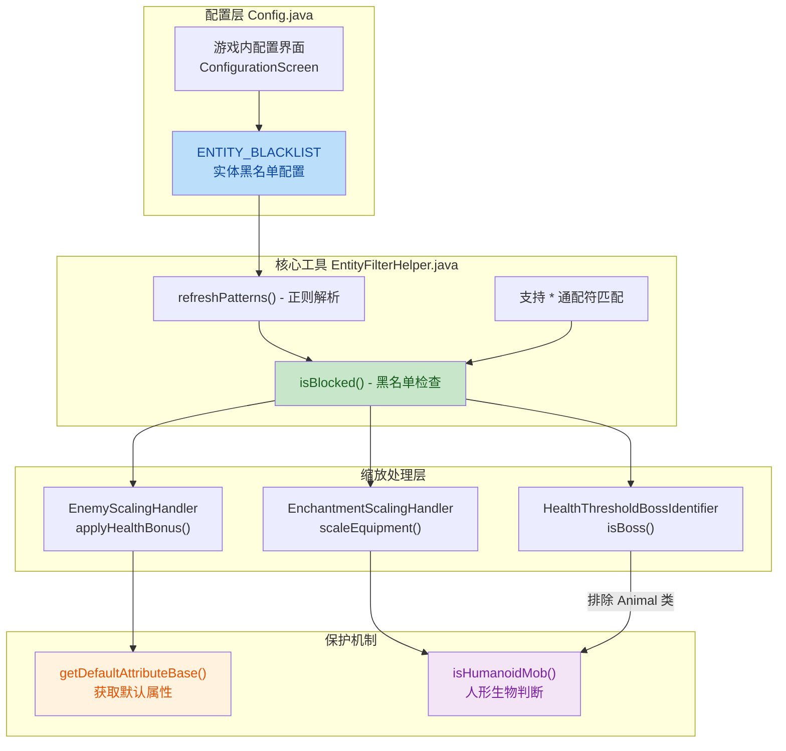
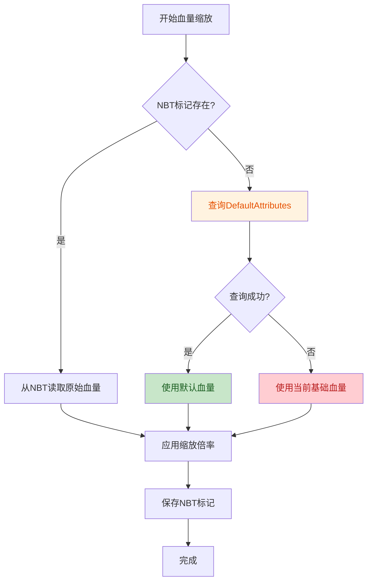

## 1. 高层摘要 (TL;DR)

*   **影响范围:** 🟡 **中等** - 新增实体过滤系统、配置界面和血量缩放保护机制
*   **核心变更:**
    *   ✨ 新增**实体黑名单配置**，支持通配符排除特定生物（如铁傀儡、模组生物）
    *   🛡️ 实现**防血量爆炸机制**，解决灵魂石抓取后NBT重置导致的属性指数级增长
    *   🎮 添加**游戏内配置界面**，无需重启即可修改配置
    *   🧍 添加**人形生物判断逻辑**，防止蜘蛛、苦力怕等非人形生物获得装备
    *   🚫 修复Boss识别误判，排除动物/傀儡类实体

---

## 2. 可视化概览 (代码与逻辑映射)



---

## 3. 详细变更分析

### 📋 配置系统增强

#### Config.java
**变更内容:**
- 新增 `ENTITY_BLACKLIST` 配置项，支持逗号分隔的实体ID列表
- 支持通配符 `*` 匹配（如 `minecraft:zombie,alexsmobs:*`）
- 优化 Apotheosis 兼容模式注释格式

**配置结构:**
| 配置键 | 类型 | 默认值 | 说明 |
|--------|------|--------|------|
| `entityFilter.entityBlacklist` | String | `""` | 实体黑名单，支持 `*` 通配符 |

#### AdaptiveNemesisMod.java
**变更内容:**
- 注册 NeoForge 配置界面扩展点 `IConfigScreenFactory`
- 仅在客户端环境注册配置界面
- 支持游戏内直接编辑配置并热重载

```java
// 新增配置界面注册逻辑
if (FMLEnvironment.dist == Dist.CLIENT) {
    modContainer.registerExtensionPoint(
        IConfigScreenFactory.class,
        (container, screen) -> new ConfigurationScreen(container, screen)
    );
}
```

---

### 🚫 实体过滤系统 (新增)

#### EntityFilterHelper.java (新文件)
**核心功能:**
- **单例模式**：全局唯一的实体过滤器实例
- **黑名单匹配**：支持通配符的正则表达式匹配
- **配置热重载**：通过哈希检测配置变化，自动重新解析
- **性能优化**：预编译正则模式，避免重复解析

**关键方法:**
| 方法 | 功能 |
|------|------|
| `isBlocked(Entity)` | 检查实体是否在黑名单中 |
| `getEntityId(Entity)` | 获取实体完整注册ID |
| `refreshPatterns()` | 刷新黑名单正则模式列表 |

**通配符转换逻辑:**
```java
// 将 minecraft:* 转换为正则 \Qminecraft\E.*\Q\E
String regex = "\\Q" + trimmed.replace("*", "\\E.*\\Q") + "\\E";
```

---

### 🛡️ 防血量爆炸机制

#### EnemyScalingHandler.java
**问题背景:**
当使用灵魂石、魂符等工具抓取生物时，NBT标记会被重置，导致已缩放的高血量被当作"原始值"再次缩放，引发指数级血量爆炸。

**解决方案:**
1. 新增 `getDefaultAttributeBase()` 方法，通过 `DefaultAttributes` 查询实体类型注册时的默认属性值
2. 修改 `applyHealthBonus()` 逻辑，采用双重回退机制：



**新增方法:**
```java
private double getDefaultAttributeBase(Mob mob, Holder<Attribute> attribute, double fallbackValue)
```

---

### 🧍 人形生物装备限制

#### EnchantmentScalingHandler.java
**变更内容:**
- 新增 `isHumanoidMob()` 方法，判断生物是否为人形（有手能拿武器）
- 只有僵尸类、骷髅类、通用型（如卫道士）才会被给予装备
- 蜘蛛、苦力怕、史莱姆等非人形生物不再获得武器/盔甲

**人形生物判断规则:**
| 生物类型 | 是否人形 | 示例 |
|----------|----------|------|
| `zombie` | ✅ | 僵尸、尸壳、溺尸 |
| `skeleton` | ✅ | 骷髅、凋零骷髅、流浪者 |
| `generic` | ✅ | 卫道士、唤魔者、掠夺者 |
| `spider` | ❌ | 蜘蛛、洞穴蜘蛛 |
| `creeper` | ❌ | 苦力怕 |

**代码逻辑:**
```java
private boolean isHumanoidMob(Mob mob) {
    String mobType = getMobType(mob);
    if ("zombie".equals(mobType) || "skeleton".equals(mobType)) {
        return true;
    }
    if ("generic".equals(mobType)) {
        return true;
    }
    return false;
}
```

---

### 🚫 Boss识别优化

#### HealthThresholdBossIdentifier.java
**变更内容:**
- 添加 `Animal` 类导入
- 在 `isBoss()` 方法中排除所有 `Animal` 子类
- 防止高血量铁傀儡、高血量动物被误识别为Boss

**修改前:**
```java
return entity.getMaxHealth() >= healthThreshold;
```

**修改后:**
```java
if (entity instanceof Animal) {
    return false;
}
return entity.getMaxHealth() >= healthThreshold;
```

---

### 🔗 事件处理器集成

#### ModEventHandler.java
**变更内容:**
- 在 `EntityJoinLevelEvent` 处理中添加黑名单检查
- 被黑名单的实体跳过Boss限伤和Boss加成

**集成点:**
```java
if (EntityFilterHelper.getInstance().isBlocked(mob)) {
    return;  // 跳过所有Boss相关处理
}
```

---

## 4. 影响与风险评估

### ✅ 功能改进
| 改进项 | 影响 |
|--------|------|
| 实体黑名单 | 允许玩家排除特定生物（如铁傀儡、宠物）不受缩放影响 |
| 配置界面 | 无需重启即可修改配置，提升用户体验 |
| 防血量爆炸 | 解决灵魂石抓取导致的属性爆炸问题 |
| 人形生物限制 | 避免非人形生物获得装备，提升游戏逻辑合理性 |
| Boss识别优化 | 防止高血量动物被误识别为Boss |

### ⚠️ 潜在风险
| 风险项 | 描述 | 建议 |
|--------|------|------|
| **配置兼容性** | 新增 `entityFilter` 配置节，旧配置文件需要重新生成 | 建议提供配置迁移指南 |
| **性能影响** | 黑名单检查涉及正则匹配，大量实体生成时可能有轻微开销 | 已通过缓存优化，实际影响极小 |
| **模组兼容性** | `DefaultAttributes` 查询可能对某些自定义实体模组不兼容 | 已添加异常捕获和回退机制 |

### 🧪 测试建议
1. **黑名单功能测试:**
   - 配置 `minecraft:iron_golem` 验证铁傀儡不被缩放
   - 配置 `alexsmobs:*` 验证通配符匹配

2. **防血量爆炸测试:**
   - 使用灵魂石抓取已缩放的生物
   - 验证血量不会指数级增长

3. **人形生物限制测试:**
   - 生成蜘蛛、苦力怕，验证不获得装备
   - 生成僵尸、骷髅，验证正常获得装备

4. **配置界面测试:**
   - 在游戏内修改配置
   - 验证修改后立即生效

---

## 5. 版本信息

| 文件 | 版本变更 |
|------|----------|
| `gradle.properties` | `1.0.4` → `1.0.5` |