## 1. 高级摘要 (TL;DR)

*   **影响范围：** 🟡 **中等** - 涉及10个命令类的所有用户界面消息
*   **核心变更：** 为所有命令输出消息添加英文翻译，实现中英文双语显示
*   **关键修改：**
    *   ✨ 所有命令帮助文本、状态消息、错误提示均采用 `中文/English` 格式
    *   🌍 提升国际化支持，方便不同语言玩家理解
    *   📝 统一翻译格式，部分使用 `/` 分隔，部分使用 `[]` 括号

---

## 2. 可视化概览 (代码与逻辑图)

```mermaid
graph TD
    subgraph "Command Layer / 命令层"
        DC["DifficultyCommand<br/>难度命令"]
        HC["HelpCommand<br/>帮助命令"]
        MC["MemoryCommand<br/>记忆命令"]
        PC["ProtectionCommand<br/>保护命令"]
        RC["ReloadCommand<br/>重载命令"]
        SC["ScanCommand<br/>扫描命令"]
        StC["StatusCommand<br/>状态命令"]
        StrC["StrengthCommand<br/>强度命令"]
        SNC["SummonNemesisCommand<br/>召唤命令"]
        TC["TestCommand<br/>测试命令"]
    end
    
    subgraph "Message Types / 消息类型"
        M1["📋 帮助信息<br/>Help Messages"]
        M2["✅ 成功提示<br/>Success Messages"]
        M3["❌ 错误提示<br/>Error Messages"]
        M4["📊 状态显示<br/>Status Display"]
        M5["⚙️ 配置信息<br/>Config Info"]
    end
    
    subgraph "Translation Format / 翻译格式"
        F1["中文/English<br/>斜杠分隔"]
        F2["中文 [English]<br/>方括号"]
    end
    
    DC --> M1
    DC --> M4
    DC --> M5
    DC --> F1
    
    HC --> M1
    HC --> F1
    
    MC --> M2
    MC --> M3
    MC --> M4
    MC --> F1
    
    PC --> M2
    PC --> M3
    PC --> M4
    PC --> F1
    
    RC --> M2
    RC --> F1
    
    SC --> M4
    SC --> F1
    
    StC --> M2
    StC --> M3
    StC --> M4
    StC --> F1
    
    StrC --> M2
    StrC --> M3
    StrC --> M4
    StrC --> F1
    
    SNC --> M2
    SNC --> F1
    
    TC --> M1
    TC --> M2
    TC --> M3
    TC --> M4
    TC --> F1
    
    style DC fill:#bbdefb,color:#0d47a1
    style HC fill:#c8e6c9,color:#1a5e20
    style MC fill:#fff3e0,color:#e65100
    style PC fill:#f3e5f5,color:#7b1fa2
    style RC fill:#ffebee,color:#c62828
    style SC fill:#e0f7fa,color:#006064
    style StC fill:#fce4ec,color:#880e4f
    style StrC fill:#f1f8e9,color:#33691e
    style SNC fill:#fff8e1,color:#ff6f00
    style TC fill:#e8eaf6,color:#283593
```



---

## 3. 详细变更分析

### 📦 组件一：核心命令类 (10个文件)

所有命令类都进行了相同的国际化改造，具体变更如下：

#### 🎯 变更内容
为所有用户界面消息添加英文翻译，采用两种格式：
- **格式A：** `中文/English` (使用斜杠分隔)
- **格式B：** `中文 [English]` (使用方括号)

#### 📋 消息类型覆盖表

| 消息类型 | 原格式 | 新格式 | 示例 |
|---------|--------|--------|------|
| **标题** | `§6===== 难度设置 =====` | `§6===== Difficulty Settings =====` | 完全替换 |
| **状态显示** | `§e状态: §a已启用` | `§e状态/Status: §a已启用(Enabled)` | 双语+括号 |
| **配置项** | `§e难度系数基准: §f%.2f` | `§e难度系数基准/Difficulty Base: §f%.2f` | 斜杠分隔 |
| **错误提示** | `❌ 此命令只能由玩家执行` | `❌ 此命令只能由玩家执行 §7[This command can only be executed by players]` | 方括号 |
| **成功消息** | `§a难度系数已设置为: §f%.2f` | `§a难度系数已设置为/Difficulty set to: §f%.2f` | 斜杠分隔 |
| **警告提示** | `§e⚠️ 注意: 配置更改将在下次重启后生效` | `§e⚠️ 注意/Note: 配置更改将在下次重启后生效 §7[Configuration changes will take effect after restart]` | 混合格式 |

#### 🔍 各命令类具体变更

| 命令类 | 主要变更消息数 | 特殊处理 |
|--------|---------------|----------|
| **DifficultyCommand** | 12处 | 难度设置、真实伤害设置双语化 |
| **HelpCommand** | 10处 | 所有帮助命令描述双语化 |
| **MemoryCommand** | 10处 | 战斗记录、KDA统计双语化 |
| **ProtectionCommand** | 9处 | 新手保护状态双语化 |
| **ReloadCommand** | 2处 | 重载提示双语化 |
| **ScanCommand** | 12处 | 扫描结果、属性显示双语化，新增英文映射switch |
| **StatusCommand** | 10处 | 玩家状态、配置显示双语化 |
| **StrengthCommand** | 9处 | 强度详情双语化 |
| **SummonNemesisCommand** | 7处 | 召唤消息、宿敌名称双语化 |
| **TestCommand** | 50+处 | 所有测试输出消息双语化 |

#### 💡 特殊实现细节

**ScanCommand.java** 新增了英文翻译映射逻辑：

```java
// 添加英文翻译映射
String nameEn = switch (name) {
    case "血量/HP" -> "HP";
    case "攻击/Damage" -> "Damage";
    case "护甲/Armor" -> "Armor";
    case "攻速/Atk Speed" -> "Atk Speed";
    case "韧性/Toughness" -> "Toughness";
    default -> name;
};
```

---

## 4. 影响与风险评估

### ⚠️ 破坏性变更
*   **无破坏性变更** - 仅修改用户界面文本，不影响功能逻辑

### ✅ 测试建议

| 测试场景 | 验证内容 |
|---------|---------|
| **命令输出显示** | 执行所有 `/an` 命令，确认消息格式正确显示中英文 |
| **错误提示** | 触发各种错误情况（如无效玩家），确认错误消息双语显示 |
| **帮助信息** | 执行 `/an help`，确认所有命令描述双语显示 |
| **测试命令** | 执行 `/an test all`，确认所有测试输出双语显示 |
| **特殊字符** | 验证Minecraft颜色代码（§）与双语文本配合正常 |
| **多行消息** | 验证多行状态消息格式对齐正确 |

### 🔍 风险点
1. **格式一致性：** 部分消息使用 `/` 分隔，部分使用 `[]` 括号，建议统一格式
2. **消息长度：** 双语文本可能导致消息过长，在聊天窗口可能换行
3. **颜色代码：** 确保颜色代码与双语文本配合正确显示

### 📊 改进建议
- 考虑将翻译提取到外部配置文件或资源包中，便于后续维护
- 统一翻译格式（建议统一使用 `中文/English` 格式）
- 考虑添加语言切换功能，允许玩家选择单一语言显示

---

## 📝 变更统计

| 指标 | 数值 |
|-----|------|
| **修改文件数** | 10个 |
| **修改代码行数** | ~200+ 行 |
| **新增消息** | 0条（仅翻译现有消息） |
| **删除消息** | 0条 |
| **翻译覆盖率** | 100%（所有UI消息） |

---

## 5. 版本信息

| 文件 | 版本变更 |
|------|----------|
| `gradle.properties` | `1.0.5` → `1.0.6` |