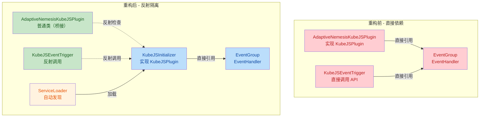
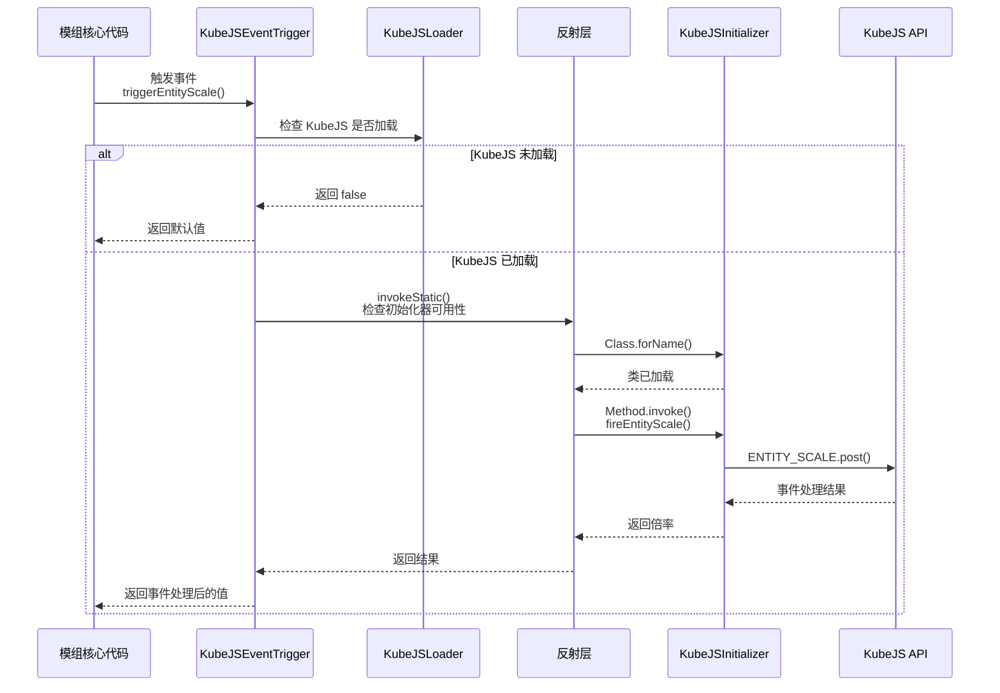

## 1. 高层摘要 (TL;DR)

*   **影响范围:** **高** - 重构了 KubeJS 集成架构，解决了可选依赖的类加载冲突问题
*   **核心变更:**
    *   🔧 将 KubeJS API 调用从主类分离到独立的 `KubeJSInitializer`
    *   🛡️ 使用反射机制实现安全调用，避免 KubeJS 未安装时的类加载错误
    *   📦 通过 ServiceLoader 机制自动发现和加载 KubeJS 插件
    *   🏷️ 版本更新至 `1.0.3hotfix`

---

## 2. 可视化架构图

### 2.1 重构前后架构对比



### 2.2 事件触发流程



---

## 3. 详细变更分析

### 3.1 构建配置变更

| 文件 | 配置项 | 旧值 | 新值 | 说明 |
|------|--------|------|------|------|
| **gradle.properties** | `mod_version` | `1.0.3` | `1.0.3hotfix` | 热修复版本号 |
| **build.gradle** | 注释格式 | `//` | `//` | 代码格式调整 |

### 3.2 核心架构重构

#### 📁 **AdaptiveNemesisKubeJSPlugin.java** - 桥接层改造

**变更类型:** 架构重构

**变更说明:**
- 从 `implements KubeJSPlugin` 改为普通类，移除所有 KubeJS API 直接引用
- 删除了 `EventGroup`、`EventHandler` 等静态常量定义
- 新增 `ensureInitialized()` 方法：通过反射检查 `KubeJSInitializer` 类是否存在
- 新增 `isInitialized()` 方法：返回初始化状态
- 类职责从"插件主类"转变为"桥接标记类"

**关键代码片段:**
```java
// 旧代码：直接实现 KubeJSPlugin 接口
public class AdaptiveNemesisKubeJSPlugin implements KubeJSPlugin {
    public static final EventGroup ADAPTIVE_NEMESIS_EVENTS = EventGroup.of("adaptive_nemesis");
    public static final EventHandler ENTITY_SCALE = ADAPTIVE_NEMESIS_EVENTS.server(...);
    
    @Override
    public void init() { ... }
    @Override
    public void registerEvents(EventGroupRegistry registry) { ... }
}

// 新代码：普通类 + 反射检查
public class AdaptiveNemesisKubeJSPlugin {
    private static boolean initialized = false;
    
    public static void ensureInitialized() {
        if (initialized) return;
        if (!KubeJSLoader.isKubeJSLoaded()) return;
        
        try {
            Class.forName("com.adaptive_nemesis.adaptive_nemesismod.kubejs.KubeJSInitializer");
            initialized = true;
        } catch (ClassNotFoundException e) {
            AdaptiveNemesisMod.LOGGER.warn("KubeJSInitializer 类未找到，KubeJS 事件不可用");
        }
    }
}
```

---

#### 📁 **KubeJSEventTrigger.java** - 反射调用层

**变更类型:** 实现重构

**变更说明:**
- 新增 `invokeStatic()` 私有方法：统一处理反射调用逻辑
- 新增 `initializerAvailable` 缓存：避免重复类加载检查
- 所有事件触发方法改为通过反射调用 `KubeJSInitializer` 的静态方法
- 错误处理从 `LOGGER.error()` 改为静默失败（fall-through）

**方法映射表:**

| 原方法 | 反射目标方法 | 参数类型 |
|--------|-------------|----------|
| `triggerEntityScale()` | `fireEntityScale()` | `Mob.class, double.class` |
| `triggerDamageCalculation()` | `fireDamageCalculation()` | `LivingEntity.class, LivingEntity.class, float.class, float.class, double.class` |
| `triggerPlayerStrengthEvaluation()` | `firePlayerStrengthEvaluation()` | `ServerPlayer.class, double.class, double.class, double.class, double.class, double.class` |
| `triggerNemesisMemoryUpdate()` | `fireNemesisMemoryUpdate()` | `UUID.class, String.class, NemesisProfile.class` |

**关键代码片段:**
```java
// 新增的反射调用方法
private static Object invokeStatic(String methodName, Class<?>[] paramTypes, Object[] args) {
    if (!KubeJSLoader.isKubeJSLoaded()) return null;
    if (initializerAvailable == null) {
        try {
            Class.forName(INITIALIZER_CLASS);
            initializerAvailable = true;
        } catch (ClassNotFoundException e) {
            initializerAvailable = false;
            return null;
        }
    }
    if (!initializerAvailable) return null;

    try {
        Class<?> clazz = Class.forName(INITIALIZER_CLASS);
        Method method = clazz.getMethod(methodName, paramTypes);
        return method.invoke(null, args);
    } catch (Exception e) {
        AdaptiveNemesisMod.LOGGER.warn("反射调用 {} 失败: {}", methodName, e.getMessage());
        return null;
    }
}
```

---

#### 📁 **KubeJSInitializer.java** - 新增 KubeJS 插件实现

**变更类型:** 新增文件

**文件说明:**
- 实现 `KubeJSPlugin` 接口，包含所有 KubeJS API 直接依赖
- 通过 ServiceLoader 机制自动发现和加载
- 提供静态方法供反射调用
- 包含完整的事件注册和触发逻辑

**事件定义表:**

| 事件常量 | 事件名称 | 事件类 |
|----------|----------|--------|
| `ENTITY_SCALE` | `entity_scale` | `EntityScaleEventJS.class` |
| `DAMAGE_CALCULATION` | `damage_calculation` | `DamageCalculationEventJS.class` |
| `PLAYER_STRENGTH_EVALUATION` | `player_strength_evaluation` | `PlayerStrengthEvaluationEventJS.class` |
| `NEMESIS_MEMORY_UPDATE` | `nemesis_memory_update` | `NemesisMemoryUpdateEventJS.class` |

**关键方法:**

```java
@Override
public void init() {
    AdaptiveNemesisMod.LOGGER.info("Adaptive Nemesis KubeJS 插件已加载！");
}

@Override
public void registerEvents(EventGroupRegistry registry) {
    registry.register(ADAPTIVE_NEMESIS_EVENTS);
    AdaptiveNemesisMod.LOGGER.info("Adaptive Nemesis KubeJS 事件已注册");
}

// 供反射调用的静态方法
public static double fireEntityScale(Mob entity, double multiplier) { ... }
public static float fireDamageCalculation(...) { ... }
public static double firePlayerStrengthEvaluation(...) { ... }
public static void fireNemesisMemoryUpdate(...) { ... }
```

---

#### 📁 **META-INF/services/dev.latvian.mods.kubejs.plugin.KubeJSPlugin** - 新增 ServiceLoader 配置

**变更类型:** 新增文件

**内容:**
```
com.adaptive_nemesis.adaptive_nemesismod.kubejs.KubeJSInitializer
```

**说明:** Java ServiceLoader 配置文件，用于 KubeJS 自动发现插件实现。

---

## 4. 影响与风险评估

### ⚠️ 破坏性变更

| 变更类型 | 影响范围 | 说明 |
|----------|----------|------|
| **类结构变更** | `AdaptiveNemesisKubeJSPlugin` | 从接口实现类变为普通类，外部代码不应依赖其实现 KubeJSPlugin |
| **方法签名变更** | `KubeJSEventTrigger` | 内部实现改为反射调用，但公共 API 保持不变 |

### ✅ 向后兼容性

- ✅ 所有公共方法签名保持不变
- ✅ 事件触发行为保持一致
- ✅ KubeJS 未安装时的行为保持一致（返回默认值）


---

## 5. 总结

本次重构通过**反射隔离 + ServiceLoader** 的架构模式，优雅地解决了 KubeJS 作为可选依赖的类加载问题。核心思想是将 KubeJS API 调用封装在独立的 `KubeJSInitializer` 类中，通过反射安全调用，确保模组在 KubeJS 未安装时也能正常运行。这是一个典型的**延迟加载**和**依赖隔离**设计模式的应用。