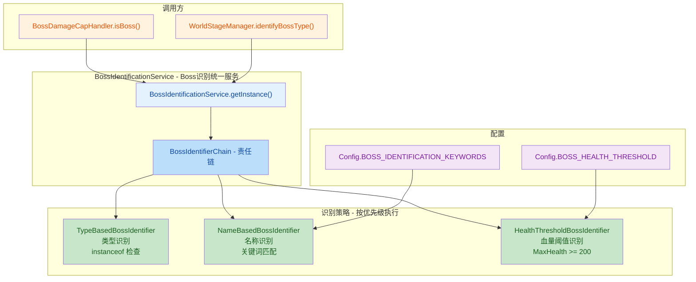
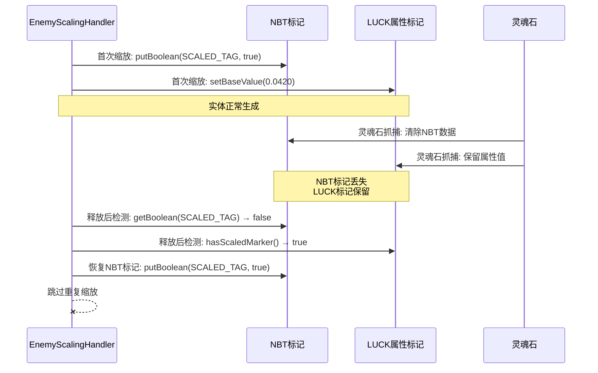
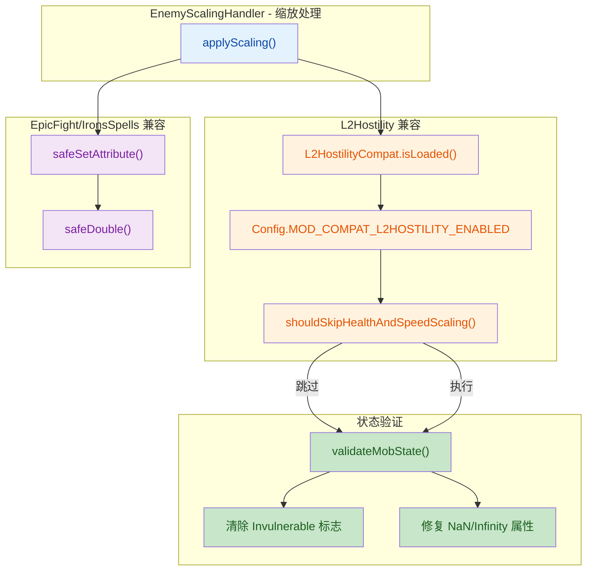

## 1. 高层摘要 (TL;DR)

*   **影响**: **高** - 重构了 Boss 识别系统架构，新增多个模组兼容性功能，修复了关键 bug
*   **核心变更**:
    *   ✨ **Boss 识别系统重构**: 采用策略模式 + 责任链模式，统一 Boss 识别逻辑
    *   🔧 **调试日志文件修复**: 实现了 Log4j2 FileAppender，修复了空壳配置问题
    *   🛡️ **危险附魔防护**: 新增危险附魔检测机制，防止怪物获得伤害免疫
    *   🔗 **模组兼容性增强**: 新增 L2Hostility 兼容，防止血量爆炸；添加 NaN/Infinity 防护
    *   🎯 **灵魂石标记系统**: 使用 LUCK 属性标记，防止灵魂石释放后重复缩放

---

## 2. 可视化概览 (代码与逻辑映射)

### 2.1 Boss 识别系统架构



### 2.2 灵魂石标记系统流程



### 2.3 模组兼容性防护机制



---

## 3. 详细变更分析

### 3.1 Boss 识别系统重构

**组件名称**: `BossIdentificationService` 及相关类

**变更说明**:
将分散在 `BossDamageCapHandler` 和 `WorldStageManager` 中的 Boss 识别逻辑抽取为统一的识别服务，采用策略模式和责任链模式实现。

**新增文件**:
| 文件名 | 说明 |
|--------|------|
| `BossIdentificationService.java` | Boss 识别统一服务（单例） |
| `BossIdentifier.java` | Boss 识别策略接口 |
| `BossIdentifierChain.java` | 责任链管理器 |
| `TypeBasedBossIdentifier.java` | 基于实体类型的识别策略 |
| `NameBasedBossIdentifier.java` | 基于名称关键词的识别策略 |
| `HealthThresholdBossIdentifier.java` | 基于血量阈值的识别策略 |

**配置项变更**:

| 配置键 | 类型 | 默认值 | 说明 |
|--------|------|--------|------|
| `bossIdentificationKeywords` | String | "boss,dragon,wither,warden" | Boss 识别关键词（逗号分隔） |
| `bossHealthThreshold` | Double | 200.0 | Boss 血量识别阈值 |

**代码示例**:
```java
// 旧代码（BossDamageCapHandler.java）
public boolean isBoss(LivingEntity entity) {
    if (entity instanceof EnderDragon || entity instanceof WitherBoss || entity instanceof Warden) {
        return true;
    }
    String entityName = entity.getType().toString().toLowerCase();
    return entityName.contains("boss") || entityName.contains("dragon") || ...;
}

// 新代码（委托给服务）
public boolean isBoss(LivingEntity entity) {
    return BossIdentificationService.getInstance().isBoss(entity);
}
```

---

### 3.2 调试日志文件功能实现

**组件名称**: `AdaptiveNemesisMod`

**变更说明**:
修复了 `debugLogToFile` 和 `debugLogFilePath` 配置项定义但从未被使用的空壳问题。使用 Log4j2 核心 API 动态附加 `FileAppender`，将模组 DEBUG 级别日志写入单独文件。

**关键代码**:
```java
private static void initDebugLogFile() {
    if (!Config.DEBUG_LOG_TO_FILE.get()) return;
    
    LoggerContext context = LoggerContext.getContext(false);
    Configuration config = context.getConfiguration();
    
    PatternLayout layout = PatternLayout.newBuilder()
        .withPattern("[%d{HH:mm:ss.SSS}][%level] %msg%n")
        .withConfiguration(config)
        .build();
    
    FileAppender appender = FileAppender.newBuilder()
        .withFileName(Config.DEBUG_LOG_FILE_PATH.get())
        .withName("AdaptiveNemesisDebugFile")
        .withAppend(true)
        .withLayout(layout)
        .withConfiguration(config)
        .build();
    appender.start();
    
    config.addAppender(appender);
    LoggerConfig loggerConfig = config.getLoggerConfig(LOGGER.getName());
    loggerConfig.addAppender(appender, Level.DEBUG, null);
    context.updateLoggers();
}
```

---

### 3.3 危险附魔防护机制

**组件名称**: `EnchantmentScalingHandler`

**变更说明**:
新增危险附魔检测机制，防止怪物获得"伤害免疫"、"无敌"等破坏游戏平衡的附魔。通过关键词匹配识别危险附魔，在装备生成时自动跳过。

**新增方法**:
```java
// 静态方法，用于单元测试
static boolean isDangerousEnchantmentKey(String text) {
    if (text == null || text.isEmpty()) return false;
    String lower = text.toLowerCase();
    return lower.contains("immune") || lower.contains("immunity")
        || lower.contains("invulnerable") || lower.contains("invincible")
        || lower.contains("no_damage") || lower.contains("damage_immunity")
        || lower.contains("免伤") || lower.contains("无敌")
        || lower.contains("免疫") || lower.contains("damage_proof")
        || lower.contains("god") || lower.contains("divine_protection");
}

// 运行时检测
private boolean isDangerousEnchantment(Holder.Reference<Enchantment> holder) {
    ResourceLocation enchantId = holder.key().location();
    String path = enchantId.getPath().toLowerCase();
    
    if (isDangerousEnchantmentKey(path)) {
        LOGGER.warn("⚠️ 跳过危险附魔: {}", enchantId);
        return true;
    }
    return false;
}
```

**测试覆盖**:
新增 `EnchantmentScalingHandlerTest.DangerousEnchantmentTests` 测试套件，覆盖:
- 已知关键词检测（英文 + 中文）
- 原版附魔不受影响
- 模组附魔不受影响
- 大小写不敏感
- 边界情况（null/空字符串）
- 用户报告的伤害免疫场景

---

### 3.4 模组兼容性增强

#### 3.4.1 L2Hostility 兼容

**组件名称**: `L2HostilityCompat` + `EnemyScalingHandler`

**变更说明**:
新增 `L2HostilityCompat` 类，防止与 L2Hostility 的 `ADD_MULTIPLIED_TOTAL` 机制叠加导致血量爆炸。

**配置项**:

| 配置键 | 类型 | 默认值 | 说明 |
|--------|------|--------|------|
| `modCompatL2HostilityEnabled` | Boolean | true | 启用 L2Hostility 兼容模式 |

**关键逻辑**:
```java
// 检测是否应跳过血量/速度缩放
public static boolean shouldSkipHealthAndSpeedScaling() {
    return isLoaded() && Config.MOD_COMPAT_L2HOSTILITY_ENABLED.get();
}

// 在 EnemyScalingHandler 中应用
private void applyHealthBonus(Mob mob, double multiplier, double randomFactor) {
    if (L2HostilityCompat.shouldSkipHealthAndSpeedScaling()) {
        LOGGER.debug("L2Hostility 兼容: 跳过 {} 的血量加成", mob.getName());
        return;
    }
    // 正常血量缩放逻辑...
}
```

#### 3.4.2 EpicFight & IronsSpells NaN/Infinity 防护

**组件名称**: `EpicFightCompat` + `IronsSpellsCompat`

**变更说明**:
在两个兼容类中新增 `safeSetAttribute()` 和 `safeDouble()` 方法，防止 NaN/Infinity 值传播导致怪物无法被攻击。

**关键代码**:
```java
private static void safeSetAttribute(AttributeInstance attr, double value, double fallback) {
    if (Double.isNaN(value) || Double.isInfinite(value)) {
        attr.setBaseValue(fallback);
        return;
    }
    attr.setBaseValue(value);
}

private static double safeDouble(double value) {
    if (Double.isNaN(value) || Double.isInfinite(value)) {
        return 1.0; // EpicFight 返回 1.0
        // IronsSpells 返回 0.0
    }
    return value;
}
```

**配置项**:

| 配置键 | 类型 | 默认值 | 说明 |
|--------|------|--------|------|
| `modCompatEpicFightEnabled` | Boolean | true | 启用史诗战斗兼容模式 |
| `modCompatIronsSpellsEnabled` | Boolean | true | 启用铁魔法兼容模式 |
| `modCompatApotheosisEnabled` | Boolean | true | 启用神化兼容模式 |

---

### 3.5 灵魂石标记系统

**组件名称**: `EnemyScalingHandler`

**变更说明**:
使用 LUCK 属性存储特征值（0.0420），作为穿越灵魂石 NBT 清除的标记手段，防止灵魂石释放后重复缩放。

**关键方法**:
```java
private static final double LUCK_MARKER_VALUE = 0.0420;

private void applyScaledMarker(Mob mob, double multiplier) {
    AttributeInstance luckAttr = mob.getAttribute(Attributes.LUCK);
    if (luckAttr != null) {
        luckAttr.setBaseValue(LUCK_MARKER_VALUE);
    }
}

private boolean hasScaledMarker(Mob mob) {
    AttributeInstance luckAttr = mob.getAttribute(Attributes.LUCK);
    return luckAttr != null && Math.abs(luckAttr.getBaseValue() - LUCK_MARKER_VALUE) < 0.001;
}
```

**检测链路**:
1. **NBT 标记**（标准路径）: `mob.getPersistentData().getBoolean(SCALED_TAG)`
2. **LUCK 属性标记**（灵魂石路径）: `hasScaledMarker(mob)`

---

### 3.6 怪物状态验证

**组件名称**: `EnchantmentScalingHandler` + `EnemyScalingHandler`

**变更说明**:
在装备生成和缩放完成后验证怪物状态，修复可能导致怪物无法被攻击的异常状态。

**验证内容**:
- 清除 `Invulnerable` 标志
- 修复 `NaN/Infinity` 的 `MAX_HEALTH` 属性
- 修复 `NaN/Infinity` 的 `ATTACK_DAMAGE` 属性
- 修复 `NaN/Infinity` 的 `ARMOR` 属性
- 确保当前血量有效

**关键代码**:
```java
private void validateMobState(Mob mob) {
    // 清除无敌标志
    if (mob.isInvulnerable()) {
        mob.setInvulnerable(false);
        LOGGER.warn("🔧 修复怪物 {} 的 Invulnerable 标志", mob.getName());
    }
    
    // 修复无效血量
    var healthAttr = mob.getAttribute(Attributes.MAX_HEALTH);
    if (healthAttr != null) {
        double health = healthAttr.getBaseValue();
        if (Double.isNaN(health) || Double.isInfinite(health) || health < 1.0) {
            healthAttr.setBaseValue(20.0);
            LOGGER.warn("🔧 修复怪物 {} 的无效 MaxHealth: {}", mob.getName(), health);
        }
    }
    
    // 确保当前血量有效
    float currentHealth = mob.getHealth();
    if (Double.isNaN(currentHealth) || Double.isInfinite(currentHealth) || currentHealth <= 0) {
        mob.setHealth(mob.getMaxHealth());
    }
}
```

---

### 3.7 配置界面更新

**组件名称**: `AdaptiveNemesisConfigScreen`

**变更说明**:
在配置界面新增"模组兼容性"分类，添加四个模组兼容性开关。

**新增配置项**:

| 配置键 | 英文标签 | 中文标签 | 说明 |
|--------|----------|----------|------|
| `modCompatL2HostilityEnabled` | L2Hostility Compat | L2Hostility 兼容 | 跳过血量/速度缩放，防止血量爆炸 |
| `modCompatEpicFightEnabled` | Epic Fight Compat | 史诗战斗兼容 | 专用权重计算，防止击飞过远 |
| `modCompatIronsSpellsEnabled` | Iron's Spells Compat | 铁魔法兼容 | 抑制刷屏式 DEBUG 日志 |
| `modCompatApotheosisEnabled` | Apotheosis Compat | 神化兼容 | 考虑神话词条加成 |

---

### 3.8 本地化文件更新

**组件名称**: `en_us.json` + `zh_cn.json`

**变更说明**:
添加新配置项的中英文翻译。

**新增条目**:
```json
{
  "adaptive_nemesis.config.category.mod_compat": "Mod Compatibility",
  "adaptive_nemesis.config.mod_compat_l2hostility": "L2Hostility Compat",
  "adaptive_nemesis.config.tooltip.mod_compat_l2hostility": "Skips health and speed scaling to prevent HP explosion caused by L2Hostility's ADD_MULTIPLIED_TOTAL mechanic",
  "adaptive_nemesis.config.mod_compat_epic_fight": "Epic Fight Compat",
  "adaptive_nemesis.config.tooltip.mod_compat_epic_fight": "Applies specialized weight calculation to prevent excessive knockback in Epic Fight mode",
  "adaptive_nemesis.config.mod_compat_irons_spells": "Iron's Spells Compat",
  "adaptive_nemesis.config.tooltip.mod_compat_irons_spells": "Suppresses spamming DEBUG logs from Iron's Spells mod",
  "adaptive_nemesis.config.mod_compat_apotheosis": "Apotheosis Compat",
  "adaptive_nemesis.config.tooltip.mod_compat_apotheosis": "Includes mythic affix bonuses from Apotheosis in player strength evaluation"
}
```

---

### 3.9 版本与元数据更新

**组件名称**: `gradle.properties` + `CHANGELOG.md`

**变更说明**:
- 版本号从 `1.0.3hotfix` 升级到 `1.0.4`
- 在 CHANGELOG 中添加调试日志文件修复说明

---

## 4. 影响与风险评估

### 4.1 破坏性变更

| 变更类型 | 影响范围 | 说明 |
|----------|----------|------|
| 配置新增 | 配置文件 | 新增 6 个配置项（Boss 识别 2 个 + 模组兼容 4 个），默认值安全 |
| API 变更 | Boss 识别 | Boss 识别逻辑从各模块抽取到统一服务，但对外接口保持兼容 |

### 4.2 潜在风险

| 风险项 | 严重性 | 缓解措施 |
|--------|--------|----------|
| ⚠️ L2Hostility 兼容可能跳过必要缩放 | 中 | 配置项默认启用，用户可手动关闭 |
| ⚠️ LUCK 属性标记可能与某些模组冲突 | 低 | 使用特殊值 0.0420，容差 0.001 |
| ⚠️ 危险附魔检测可能误杀正常附魔 | 低 | 仅检测特定关键词，测试覆盖充分 |

### 4.3 测试建议

**功能测试**:
- ✅ 验证原版 Boss（末影龙、凋灵、监守者）识别正确
- ✅ 验证模组 Boss 通过名称关键词识别
- ✅ 验证高血量实体（>200 HP）被识别为 Boss
- ✅ 验证灵魂石抓取/释放后怪物不重复缩放
- ✅ 验证 L2Hostility 加载时血量不爆炸
- ✅ 验证危险附魔被正确跳过

**兼容性测试**:
- ✅ 测试与 L2Hostility 共同运行
- ✅ 测试与 EpicFight 共同运行
- ✅ 测试与 IronsSpells 共同运行
- ✅ 测试与 Apotheosis 共同运行

**边界测试**:
- ✅ 测试 NaN/Infinity 属性值被正确修复
- ✅ 测试怪物生成后状态验证
- ✅ 测试调试日志文件正确写入

---

## 5. 总结

本次更新是一个**高质量的功能增强版本**，主要亮点：

1. **架构优化**: Boss 识别系统采用策略模式 + 责任链模式，代码可维护性大幅提升
2. **Bug 修复**: 修复了调试日志文件空壳配置问题，实现了完整的日志文件输出功能
3. **安全增强**: 新增危险附魔检测和 NaN/Infinity 防护，防止游戏破坏性状态
4. **兼容性提升**: 新增 L2Hostility 兼容，防止血量爆炸；增强 EpicFight/IronsSpells 兼容性
5. **灵魂石支持**: 使用 LUCK 属性标记，完美支持灵魂石场景

**建议**: 在发布前进行完整的模组兼容性测试，特别是与 L2Hostility 的联合运行场景。