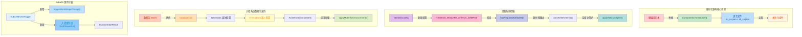

## 1. 高层摘要（TL;DR）

**影响范围：** 🟡 中等 - 完成核心系统国际化重构，增强宿敌与入侵系统的可扩展性

**核心变更：**
- 🌐 **全面国际化重构**：将硬编码中文文本替换为翻译键，支持多语言
- 👹 **宿敌系统增强**：新增攻击力属性检查，防止非攻击型生物转化导致的崩溃
- 🏰 **入侵系统扩展**：支持数据包自定义敌人配置（药水效果、冰霜行者、自定义名称等）
- 🔗 **KubeJS API 扩展**：新增世界阶段变化、入侵波次/结束事件
- 📦 **版本升级**：1.0.11 → 1.0.12

---

## 2. 视觉概览（代码与逻辑映射）


```mermaid
flowchart TD
    subgraph Internationalization["国际化重构核心流程"]
        Hardcoded["硬编码文本"] -->|"替换"| Translatable["Component.translatable()"]
        Translatable --> LangFiles["语言文件<br/>en_us.json + zh_cn.json"]
        LangFiles -->|"读取"| Component["本地化组件"]
        
        style Hardcoded fill:#ffcdd2,color:#b71c1c
        style Translatable fill:#c8e6c9,color:#1b5e20
        style LangFiles fill:#bbdefb,color:#0d47a1
        style Component fill:#fff3e0,color:#e65100
    end

    subgraph NemesisSystem["宿敌系统增强"]
        Config["NemesisConfig"] -->|新增配置| RequireAttack["NEMESIS_REQUIRE_ATTACK_DAMAGE"]
        RequireAttack -->|"检查"| HasAttributes["hasRequiredAttributes()"]
        HasAttributes -->|"缺失则跳过"| Convert["convertToNemesis()"]
        Convert -->|"空指针保护"| ApplyStats["applyStatsMultiplier()"]
        
        style Config fill:#e1bee7,color:#4a148c
        style RequireAttack fill:#f8bbd0,color:#880e4f
        style HasAttributes fill:#c5cae9,color:#1a237e
        style ApplyStats fill:#b2dfdb,color:#00695c
    end

    subgraph InvasionSystem["入侵系统数据包支持"]
        DataPack["数据包 JSON"] -->|"解析"| InvasionData["InvasionData"]
        InvasionData --> WaveData["WaveData 波次配置"]
        WaveData --> EnemyData["EnemyData 敌人配置"]
        EnemyData --> MobInfo["ActiveInvasion.MobInfo"]
        MobInfo -->|"应用增强"| ApplyEffects["applyMobInfoEnhancements()"]
        
        style DataPack fill:#ffccbc,color:#bf360c
        style InvasionData fill:#ffe0b2,color:#e65100
        style EnemyData fill:#fff9c4,color:#f57f17
        style ApplyEffects fill:#dcedc8,color:#33691e
    end

    subgraph KubeJS["KubeJS 事件扩展"]
        KubeJSEventTrigger["KubeJSEventTrigger"] -->|新增| WorldStageEvent["triggerWorldStageChange()"]
        KubeJSEventTrigger -->|新增| InvasionsEvents["入侵事件组<br/>Start/Wave/End"]
        InvasionsEvents --> InvasionResult["InvasionStartResult"]
        
        style KubeJSEventTrigger fill:#e3f2fd,color:#01579b
        style WorldStageEvent fill:#bbdefb,color:#0277bd
        style InvasionsEvents fill:#90caf9,color:#0288d1
    end
```

**架构设计说明：**
- **国际化模式**：采用"翻译键 + 语言文件"分离模式，所有用户可见文本通过 `Component.translatable()` 动态本地化
- **空值保护模式**：宿敌系统对所有实体属性进行 `null` 检查，兼容模组生物和特殊实体
- **数据驱动模式**：入侵系统支持通过数据包 JSON 完整自定义波次、敌人、效果

---

## 3. 详细变更分析

### 3.1 国际化重构（核心变更）

**涉及文件：**
- `src/main/java/com/adaptive_nemesis/adaptive_nemesismod/invasion/InvasionSystem.java`
- `src/main/java/com/adaptive_nemesis/adaptive_nemesismod/nemesis/NemesisSystem.java`
- `src/main/java/com/adaptive_nemesis/adaptive_nemesismod/memory/NemesisMemorySystem.java`
- `src/main/resources/assets/adaptive_nemesis/lang/en_us.json`
- `src/main/resources/assets/adaptive_nemesis/lang/zh_cn.json`

**变更内容：**

| 原实现 | 新实现 | 文件来源 |
|--------|--------|----------|
| `Component.literal("亡灵军团正在逼近...")` | `Component.translatable("adaptive_nemesis.invasion.approaching")` | `InvasionSystem.java:150` |
| `Component.literal("⚠ 宿敌出现！")` | `Component.translatable("adaptive_nemesis.nemesis.appearance_warning")` | `NemesisSystem.java:170` |
| `MELEE("近战")` | `MELEE("adaptive_nemesis.combat_style.melee")` | `NemesisMemorySystem.java:264` |

**新增翻译键（部分）：**

| 翻译键 | 英文 | 中文 | 用途 |
|--------|------|------|------|
| `adaptive_nemesis.invasion.approaching` | Undead legion approaching... | 亡灵军团正在逼近... | 入侵开始提示 |
| `adaptive_nemesis.invasion.wave_cleared` | Wave %s cleared! | 第 %s 波已清除！ | 波次清除提示 |
| `adaptive_nemesis.invasion.defeated` | Undead legion defeated! | 亡灵军团已被击败！ | 入侵胜利提示 |
| `adaptive_nemesis.nemesis.appearance_warning` | ⚠ Nemesis appeared! | ⚠ 宿敌出现！ | 宿敌生成警告 |
| `adaptive_nemesis.combat_style.melee` | Melee | 近战 | 战斗风格显示 |

**语言文件优化：**
- 移除了大量空行，优化 JSON 格式
- 新增入侵事件相关翻译键（约 10+ 条）
- 新增战斗风格翻译键（3 条）

---

### 3.2 宿敌系统增强

**涉及文件：**
- `src/main/java/com/adaptive_nemesis/Config.java`
- `src/main/java/com/adaptive_nemesis/adaptive_nemesismod/config/NemesisConfig.java`
- `src/main/java/com/adaptive_nemesis/adaptive_nemesismod/nemesis/NemesisSystem.java`

**新增配置项：**

| 配置键 | 默认值 | 说明 | 文件来源 |
|--------|--------|------|----------|
| `NEMESIS_REQUIRE_ATTACK_DAMAGE` | `true` | 宿敌转化是否要求目标具有攻击力属性 | `NemesisConfig.java:80` |

**新增方法：**

```java
// NemesisSystem.java:115
private boolean hasRequiredAttributes(Mob monster) {
    if (!Config.NEMESIS_REQUIRE_ATTACK_DAMAGE.get()) {
        return true;
    }
    return monster.getAttribute(Attributes.ATTACK_DAMAGE) != null;
}
```

**属性强化空指针保护：**

| 属性 | 原实现 | 新实现 | 变更原因 |
|------|--------|--------|----------|
| 最大生命值 | 直接调用 | `var maxHealthAttr = monster.getAttribute(...)` + null 检查 | 防止缺失属性崩溃 |
| 攻击力 | 直接调用 | `var attackDamageAttr = monster.getAttribute(...)` + null 检查 | 防止缺失属性崩溃 |
| 护甲值 | 直接调用 | `var armorAttr = monster.getAttribute(...)` + null 检查 | 防止缺失属性崩溃 |
| 移动速度 | 直接调用 | `var movementSpeedAttr = monster.getAttribute(...)` + null 检查 | 防止缺失属性崩溃 |

**效果：**
- 防止模组添加的特殊生物（如非战斗型生物）因缺少属性导致游戏崩溃
- 配置化控制是否强制要求攻击力属性

---

### 3.3 入侵系统数据包支持

**涉及文件：**
- `src/main/java/com/adaptive_nemesis/adaptive_nemesismod/invasion/InvasionData.java`（新增）
- `src/main/java/com/adaptive_nemesis/adaptive_nemesismod/invasion/InvasionDataLoader.java`（新增）
- `src/main/java/com/adaptive_nemesis/adaptive_nemesismod/invasion/InvasionRewardData.java`
- `src/main/java/com/adaptive_nemesis/adaptive_nemesismod/invasion/InvasionSystem.java`
- `src/main/java/com/adaptive_nemesis/adaptive_nemesismod/invasion/ActiveInvasion.java`

**新增数据结构：**

| 类 | 用途 | 关键字段 |
|----|------|----------|
| `InvasionData` | 入侵配置总容器 | id, nameKey, maxWaves, spawnDistance, waves, rewards |
| `InvasionData.WaveData` | 波次配置 | waveNumber, difficultyMultiplier, enemies |
| `InvasionData.EnemyData` | 敌人配置 | entityType, count, weight, isBoss, equipmentLootTable, effects, glowing, frostWalker, customNameKey, healthMultiplier, damageMultiplier |

**ActiveInvasion.MobInfo 新增字段：**

| 字段 | 类型 | 默认值 | 说明 |
|------|------|--------|------|
| `effects` | `List<MobEffectInstance>` | `new ArrayList<>()` | 药水效果列表 |
| `glowing` | `boolean` | `false` | 是否发光 |
| `frostWalker` | `boolean` | `false` | 是否冰霜行者 |
| `customNameKey` | `String` | `null` | 自定义名称翻译键 |
| `healthMultiplier` | `double` | `1.0` | 血量倍率 |
| `damageMultiplier` | `double` | `1.0` | 攻击倍率 |
| `equipmentLootTable` | `ResourceLocation` | `null` | 装备战利品表 |

**新增增强应用方法：**

```java
// InvasionSystem.java:429
private void applyMobInfoEnhancements(LivingEntity enemy, ActiveInvasion.MobInfo mobInfo) {
    // 自定义名称
    if (mobInfo.customNameKey != null && !mobInfo.customNameKey.isEmpty()) {
        enemy.setCustomName(Component.translatable(mobInfo.customNameKey));
        enemy.setCustomNameVisible(true);
    }
    
    // 药水效果
    for (MobEffectInstance effect : mobInfo.effects) {
        enemy.addEffect(new MobEffectInstance(effect));
    }
    
    // 发光
    if (mobInfo.glowing) {
        enemy.setGlowingTag(true);
    }
    
    // 冰霜行者：通过装备靴子实现
    if (mobInfo.frostWalker && enemy instanceof Mob mob) {
        applyFrostWalkerBoots(mob);
    }
}
```

**冰霜行者实现：**
- 自动为怪物装备带有 `frost_walker` 附魔的 `iron_boots`
- 掉落概率设为 0，防止玩家获取

---

### 3.4 KubeJS API 扩展

**涉及文件：**
- `src/main/java/com/adaptive_nemesis/adaptive_nemesismod/kubejs/KubeJSEventTrigger.java`
- `src/main/java/com/adaptive_nemesis/adaptive_nemesismod/kubejs/InvasionEndEventJS.java`（新增）
- `src/main/java/com/adaptive_nemesis/adaptive_nemesismod/kubejs/InvasionStartEventJS.java`（新增）
- `src/main/java/com/adaptive_nemesis/adaptive_nemesismod/kubejs/InvasionWaveStartEventJS.java`（新增）
- `src/main/java/com/adaptive_nemesis/adaptive_nemesismod/kubejs/WorldStageChangeEventJS.java`（新增）

**新增事件：**

| 事件方法 | 参数 | 返回值 | 说明 |
|----------|------|--------|------|
| `triggerWorldStageChange()` | player, oldStage, newStage, stageMultiplier, defeatedBossCount | double | 世界阶段变化 |
| `triggerInvasionStart()` | player, type, totalWaves, difficultyMultiplier | InvasionStartResult | 入侵开始（可取消） |
| `triggerInvasionWaveStart()` | player, type, currentWave, totalWaves, difficultyMultiplier | void | 波次开始 |
| `triggerInvasionEnd()` | player, type, victory, totalWaves, difficultyMultiplier, wavesCompleted, rewards | InvasionRewardData | 入侵结束 |

**InvasionStartResult 数据结构：**
```java
public static class InvasionStartResult {
    public final int totalWaves;
    public final double difficultyMultiplier;
}
```

**KubeJS 用例示例：**
```js
// world_stage_change.js
onEvent('adaptive_nemesis.world_stage_change', event => {
    if (event.newStage === 2) {
        event.stageMultiplier = 1.5; // 修改难度倍率
    }
});

// invasion_events.js
onEvent('adaptive_nemesis.invasion.start', event => {
    event.totalWaves = 10; // 修改波次数
    event.difficultyMultiplier = 2.0; // 修改难度
});
```

---

### 3.5 版本升级

| 配置文件 | 配置项 | 旧值 | 新值 |
|----------|--------|------|------|
| `gradle.properties` | `mod_version` | `1.0.11` | `1.0.12` |

---

## 4. 影响与风险评估

### 4.1 破坏性变更

| 变更类型 | 影响范围 | 说明 |
|----------|----------|------|
| 配置新增 | 宿敌系统 | 新增 `NEMESIS_REQUIRE_ATTACK_DAMAGE` 配置项（默认 `true`），可能导致之前可转化的非攻击型生物不再转化为宿敌 |
| 代码行为 | 宿敌生成 | 开启配置后，缺少 `generic.attack_damage` 属性的生物将被跳过转化 |

### 4.2 兼容性风险

| 风险项 | 影响 | 缓解措施 |
|--------|------|----------|
| 翻译键缺失 | 语言文件未同步时显示键名 | 已同时更新 en_us.json 和 zh_cn.json |
| 模组生物兼容性 | 某些模组生物可能缺少攻击力属性 | 通过配置项 `NEMESIS_REQUIRE_ATTACK_DAMAGE` 可关闭检查 |
| KubeJS 事件脚本 | 新增事件需要脚本适配 | 事件为可选触发，无脚本时正常运行 |

### 4.3 测试建议

#### 功能测试
- ✅ **入侵系统**：
  - 验证数据包自定义入侵的敌人药水效果是否正确应用
  - 验证 `frostWalker` 效果是否让怪物在水面行走
  - 验证自定义名称翻译键是否正确显示

- ✅ **宿敌系统**：
  - 测试开启 `NEMESIS_REQUIRE_ATTACK_DAMAGE` 后，非攻击型生物是否被跳过
  - 测试关闭配置后，所有生物是否正常转化
  - 测试模组生物（如某些被动生物）是否不会因缺失属性崩溃

- ✅ **国际化**：
  - 切换到英文环境，验证所有提示文本是否正确翻译
  - 切换到中文环境，验证战斗风格等枚举显示是否正确

#### 边界测试
- 测试入侵波次配置为极大值时的行为
- 测试宿敌属性倍率为负数时的保护机制
- 测试数据包 JSON 格式错误时的容错能力

---

## 5. 数据包示例

**自定义入侵配置示例：**

```json
{
  "type": "adaptive_nemesis:invasion",
  "name": "nether_invasion",
  "base_wave_count": 3,
  "max_wave_count": 6,
  "spawn_distance": 40,
  "waves": [
    {
      "wave_number": 1,
      "difficulty_multiplier": 1.5,
      "enemies": [
        {
          "entity_type": "minecraft:blaze",
          "count": 5,
          "weight": 10,
          "isBoss": false,
          "effects": [
            {
              "effect": "minecraft:fire_resistance",
              "duration": 600,
              "amplifier": 0
            }
          ],
          "glowing": true,
          "frostWalker": false,
          "customNameKey": "adaptive_nemesis.invasion.custom_blaze",
          "healthMultiplier": 1.2,
          "damageMultiplier": 1.3
        }
      ]
    }
  ],
  "rewards": {
    "common": [
      {
        "item": "minecraft:blaze_rod",
        "count": 4,
        "chance": 0.5
      }
    ]
  }
}
```

---

## 6. 总结

本次更新完成了模组的**国际化重构**和**系统增强**两大目标：

1. **国际化重构**：将所有用户可见文本从硬编码中文改为翻译键，为多语言支持奠定基础
2. **宿敌系统增强**：通过属性检查和空指针保护，提升模组兼容性和稳定性
3. **入侵系统扩展**：数据包支持大幅提升了入侵事件的可定制性，药水效果、冰霜行者等新特性丰富了玩法
4. **KubeJS API 扩展**：新增世界阶段和入侵相关事件，为服务器脚本化提供更多钩子

这些变更使模组更加**模块化、可扩展、国际化**，同时保持了向后兼容性。