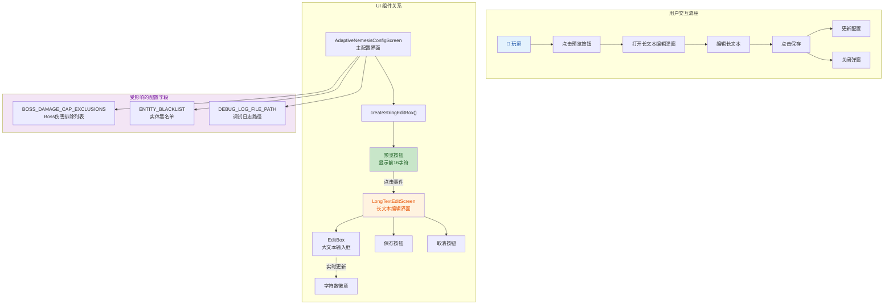
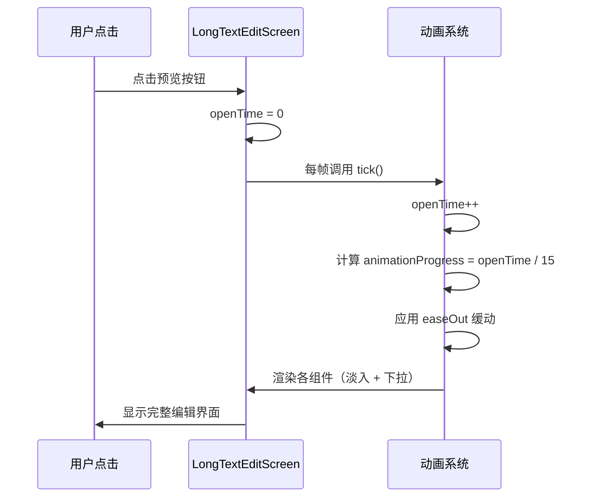

## 1. 高层摘要（TL;DR）

**影响范围：** 🟡 中等 - 优化了 Minecraft 模组的配置界面用户体验

**核心变更：**
- ✨ 新增专用的长文本编辑弹窗界面 `LongTextEditScreen`
- 🔧 重构配置界面，将长文本输入框改为按钮预览+二级编辑模式
- 📦 模组版本从 1.0.9 升级到 1.0.10
- 🧹 清理了临时重构审查报告文件

---

## 2. 视觉概览（代码与逻辑图）


```mermaid
flowchart TD
    subgraph UserInteraction["用户交互流程"]
        User["👤 玩家"] --> ClickButton["点击预览按钮"]
        ClickButton --> OpenModal["打开长文本编辑弹窗"]
        OpenModal --> EditText["编辑长文本"]
        EditText --> ClickSave["点击保存"]
        ClickSave --> UpdateConfig["更新配置"]
        ClickSave --> CloseModal["关闭弹窗"]
    end

    subgraph UIComponents["UI 组件关系"]
        ConfigScreen["AdaptiveNemesisConfigScreen<br/>主配置界面"] --> createButton["createStringEditBox()"]
        createButton --> PreviewBtn["预览按钮<br/>显示前16字符"]
        PreviewBtn -->|点击事件| LongTextScreen["LongTextEditScreen<br/>长文本编辑界面"]
        
        LongTextScreen --> EditBox["EditBox<br/>大文本输入框"]
        LongTextScreen --> SaveBtn["保存按钮"]
        LongTextScreen --> CancelBtn["取消按钮"]
        
        EditBox -.->|实时更新| CharBadge["字符数徽章"]
    end

    subgraph ConfigFields["受影响的配置字段"]
        ConfigScreen --> BossExclusions["BOSS_DAMAGE_CAP_EXCLUSIONS<br/>Boss伤害排除列表"]
        ConfigScreen --> EntityBlacklist["ENTITY_BLACKLIST<br/>实体黑名单"]
        ConfigScreen --> DebugLogPath["DEBUG_LOG_FILE_PATH<br/>调试日志路径"]
    end

    style User fill:#e3f2fd,color:#0d47a1
    style LongTextScreen fill:#fff3e0,color:#e65100
    style PreviewBtn fill:#c8e6c9,color:#1a5e20
    style ConfigFields fill:#f3e5f5,color:#7b1fa2
```

**架构设计说明：**
- **业务目标：** 解决配置界面中长文本字段（如实体黑名单、Boss排除列表）编辑困难的问题
- **核心模式：** 采用"预览按钮 + 弹窗编辑"模式，替代原有的窄小输入框
- **关键方法：** `createStringEditBox()` 负责创建预览按钮，`LongTextEditScreen` 提供完整的编辑体验

---

## 3. 详细变更分析

### 3.1 新增文件：长文本编辑界面

**文件：** `src/main/java/com/adaptive_nemesis/adaptive_nemesismod/client/LongTextEditScreen.java`（新增）

**核心功能：**
为配置文件中需要输入较长文本的字段（如实体黑名单、Boss伤害排除列表等）提供更大的编辑区域，替代原先窄小的 `EditBox` 输入体验。

**主要特性：**

| 特性 | 实现细节 |
|------|----------|
| 🎨 视觉风格 | 与主配置界面保持一致的深色主题，包含淡入动画 |
| 📐 自适应布局 | 文本框宽度根据屏幕尺寸自适应，最大 640px |
| ✨ 动画效果 | 15 帧淡入动画，使用缓动函数 `easeOut` |
| 🔤 字符计数 | 实时显示字符数量徽章 |
| 🎯 聚焦高亮 | 输入框聚焦时显示橙色外发光效果 |
| 🔘 主题按钮 | 内置 `ThemeButton` 类，支持强调色（橙色）和普通色（灰色） |

**关键代码组件：**

```java
// 主题按钮颜色定义
private static final int ACCENT_BG = 0xFF3A2A0A;      // 强调按钮背景
private static final int ACCENT_HOVER = 0xFF4A3A1A;   // 强调按钮悬停
private static final int ACCENT_BORDER = 0xFFFFB020;  // 强调按钮边框（橙色）
```

**动画流程：**


```mermaid
sequenceDiagram
    participant U as 用户点击
    participant S as LongTextEditScreen
    participant A as 动画系统

    U->>S: 点击预览按钮
    S->>S: openTime = 0
    S->>A: 每帧调用 tick()
    A->>A: openTime++
    A->>A: 计算 animationProgress = openTime / 15
    A->>A: 应用 easeOut 缓动
    A->>S: 渲染各组件（淡入 + 下拉）
    S->>U: 显示完整编辑界面
```

---

### 3.2 重构：配置界面长文本编辑方式

**文件：** `src/main/java/com/adaptive_nemesis/adaptive_nemesismod/client/AdaptiveNemesisConfigScreen.java`

**变更内容：**

| 配置字段 | 原实现 | 新实现 | 变更原因 |
|----------|--------|--------|----------|
| `BOSS_DAMAGE_CAP_EXCLUSIONS` | 窄小 `EditBox` | 预览按钮 + 二级编辑 | 列表过长难以编辑 |
| `ENTITY_BLACKLIST` | 窄小 `EditBox` | 预览按钮 + 二级编辑 | 黑名单项数多 |
| `DEBUG_LOG_FILE_PATH` | 窄小 `EditBox` | 预览按钮 + 二级编辑 | 路径文本较长 |

**关键方法重构：**

**原方法：**
```java
private EditBox createStringEditBox(String initialValue, Consumer<String> onChange) {
    EditBox box = new EditBox(this.minecraft.font, 0, 0, WIDGET_WIDTH, 20, Component.empty());
    box.setValue(initialValue);
    box.setResponder(value -> {
        if (!value.isEmpty()) {
            onChange.accept(value);
        }
    });
    return box;
}
```

**新方法：**
```java
private AbstractWidget createStringEditBox(String labelKey, Supplier<String> valueGetter,
                                            Consumer<String> onChange) {
    Button button = Button.builder(
        Component.literal(truncatePreview(valueGetter.get())),
        btn -> {
            String currentValue = valueGetter.get();
            this.minecraft.setScreen(new LongTextEditScreen(this,
                Component.translatable(labelKey), currentValue, newValue -> {
                    onChange.accept(newValue);
                    btn.setMessage(Component.literal(truncatePreview(newValue)));
                }));
        }
    ).bounds(0, 0, WIDGET_WIDTH, 20).build();
    return button;
}
```

**新增辅助方法：**
```java
/** 截断文本为按钮预览长度，超长部分替换为 ... */
private static String truncatePreview(String text) {
    if (text == null || text.isEmpty()) {
        return "[点击编辑]";  // [点击编辑]
    }
    return text.length() > 16 ? text.substring(0, 16) + "..." : text;
}
```

**设计模式变更：**
- 从 **直接编辑** 模式变为 **预览 + 弹窗** 模式
- 使用 `Supplier<String>` 实现懒加载，避免配置值未更新的问题
- 回调函数中同时更新配置值和按钮显示文本

---

### 3.3 语言文件更新

**文件：** `src/main/resources/assets/adaptive_nemesis/lang/en_us.json` 和 `zh_cn.json`

| 语言键 | 英文值 | 中文值 |
|--------|--------|--------|
| `adaptive_nemesis.config.edit.char_count` | characters | 个字符 |

**用途：** 在长文本编辑界面的字符数徽章中显示单位。

---

### 3.4 版本与清理

| 文件 | 变更类型 | 详细内容 |
|------|----------|----------|
| `gradle.properties` | 版本升级 | `mod_version` 从 `1.0.9` 升级到 `1.0.10` |
| `REFACTOR_REVIEW_REPORT.md` | 文件删除 | 清理临时重构审查报告（包含32项问题分析） |

---

## 4. 影响与风险评估

### ⚠️ 风险点

| 风险类型 | 描述 | 缓解措施 |
|----------|------|----------|
| **配置丢失** | 用户在弹窗中编辑后点击取消可能导致未保存的更改丢失 | 现有实现正确，取消时不调用保存回调 |
| **空值处理** | 预览按钮点击时 `valueGetter.get()` 可能返回 null | `truncatePreview` 方法已包含 null 检查，返回 `[点击编辑]` |
| **动画卡顿** | 淡入动画可能在低性能设备上影响体验 | 动画仅 15 帧（约 0.25秒），影响极小 |
| **编码兼容性** | 使用 `Character.toString()` 等方法在不同 JVM 版本 | 使用标准 API，无兼容性问题 |

### ✅ 测试建议

**功能测试：**
1. **基础编辑流程：**
   - 点击"Boss伤害排除列表"预览按钮
   - 在弹窗中输入长文本（超过 100 字符）
   - 点击保存，验证主界面按钮文本更新为预览格式
   - 重新打开弹窗，验证文本正确加载

2. **取消操作：**
   - 编辑文本后点击取消
   - 验证配置值未改变，按钮文本未更新

3. **空值场景：**
   - 将配置字段清空
   - 验证预览按钮显示 `[点击编辑]`
   - 点击后弹窗为空

4. **字符计数：**
   - 输入不同长度的文本
   - 验证字符数徽章实时更新
   - 验证中英文字符计数正确

**UI/UX 测试：**
1. **动画效果：**
   - 验证弹窗打开时的淡入动画流畅
   - 验证各元素（标题、面板、输入框）的动画顺序正确

2. **视觉一致性：**
   - 对比主配置界面颜色，确保新界面风格一致
   - 验证输入框聚焦时的外发光效果
   - 验证保存按钮（橙色）和取消按钮（灰色）的区别

3. **响应式布局：**
   - 在不同屏幕尺寸下测试
   - 验证文本框宽度自适应

**边缘情况：**
1. 超长文本输入（超过 10000 字符）
2. 特殊字符输入（换行符、Unicode 字符）
3. 快速连续打开/关闭弹窗

---

## 5. 变更价值总结

### 🎯 用户体验提升
- **编辑体验：** 从窄小的 320px 输入框升级到 640px 自适应宽度
- **视觉反馈：** 新增字符计数、聚焦高亮、淡入动画等视觉增强
- **操作流畅：** 预览按钮让用户快速定位需要编辑的长文本字段

### 🔧 代码质量
- **模块化设计：** 将长文本编辑逻辑独立为 `LongTextEditScreen` 类
- **可维护性：** 使用 `Supplier` 模式实现配置值的懒加载
- **一致性：** 内置 `ThemeButton` 确保整个模组的 UI 风格统一

### 📊 性能影响
- **内存占用：** 新增一个 Screen 类，但仅在打开弹窗时实例化，影响可忽略
- **渲染开销：** 自定义渲染逻辑在弹窗关闭时不执行，无额外开销

---

## 6. 关键代码片段

**长文本编辑界面初始化（关键逻辑）：**

```java
@Override
protected void init() {
    // 文本框尺寸：宽屏自适应
    int boxWidth = Math.min(this.width - PADDING * 2, 640);
    int boxX = (this.width - boxWidth) / 2;
    int boxY = HEADER_HEIGHT + 24;

    textField = new EditBox(this.font, boxX, boxY, boxWidth, 22, Component.empty());
    textField.setMaxLength(Integer.MAX_VALUE);  // 支持超长文本
    textField.setValue(initialValue);
    textField.setResponder(value -> this.currentValue = value);
    textField.setFocused(true);
    textField.setBordered(false);  // 禁用原版边框
    textField.setTextColor(TEXT_PRIMARY);
    this.addRenderableWidget(textField);

    // 保存按钮（强调色）
    this.addRenderableWidget(new ThemeButton(
            this.width / 2 - 110, this.height - BOTTOM_BAR_HEIGHT + 14,
            100, 22,
            CommonComponents.GUI_DONE,
            button -> {
                if (onSave != null) {
                    onSave.accept(currentValue);  // 调用保存回调
                }
                this.minecraft.setScreen(parent);  // 返回父界面
            },
            true  // 强调色
    ));
}
```

**预览按钮创建（集成点）：**

```java
currentY = addConfigEntry(currentY, "adaptive_nemesis.config.boss_damage_cap_exclusions",
    "adaptive_nemesis.config.tooltip.boss_damage_cap_exclusions",
    createStringEditBox("adaptive_nemesis.config.boss_damage_cap_exclusions",
        () -> Config.BOSS_DAMAGE_CAP_EXCLUSIONS.get(),  // 懒加载当前值
        value -> { 
            Config.BOSS_DAMAGE_CAP_EXCLUSIONS.set(value); 
            markChanged(); 
        }),
    widgetX);
```

---

**变更统计：**
- 新增文件：1 个（`LongTextEditScreen.java`，361 行）
- 修改文件：3 个（配置界面、语言文件、版本号）
- 删除文件：1 个（重构报告）
- 总代码行数变化：+361 行（新增）- 211 行（删除）= +150 行