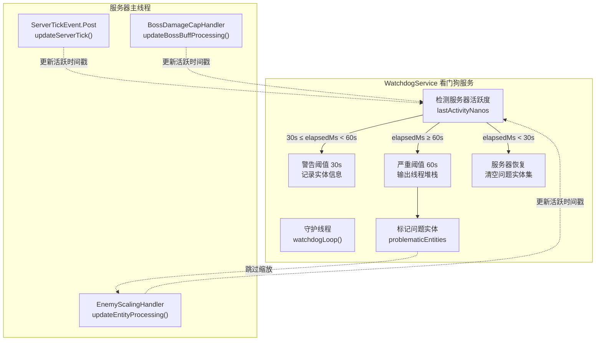
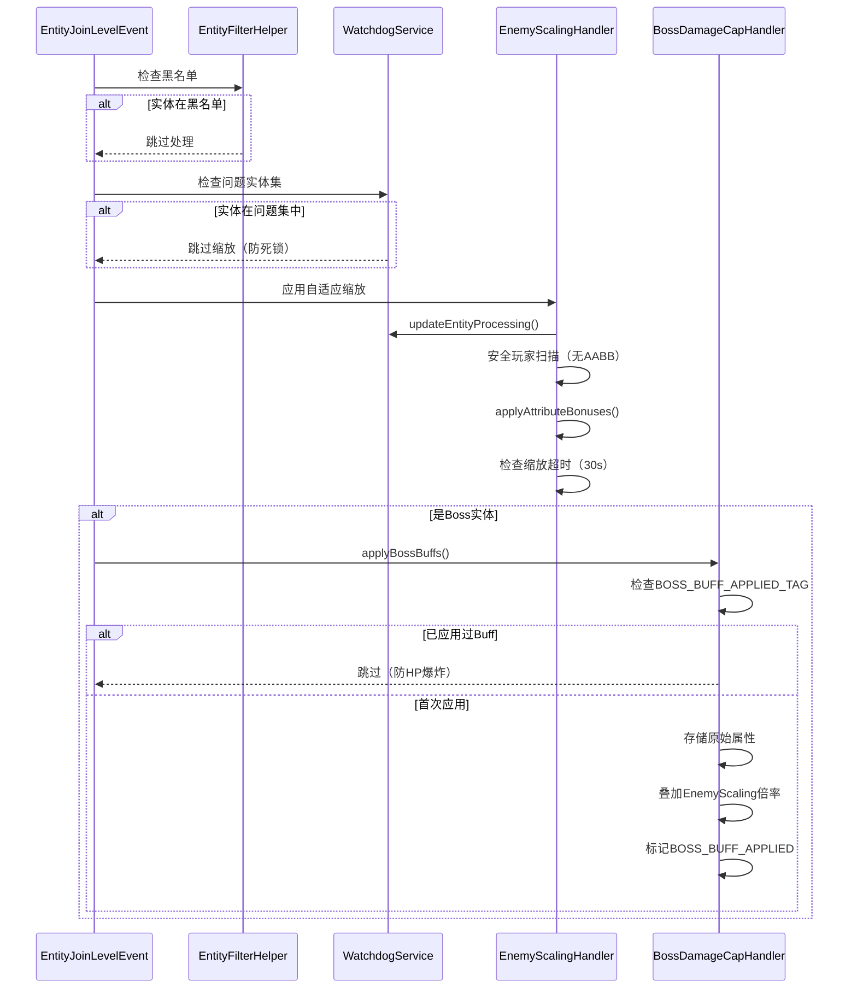
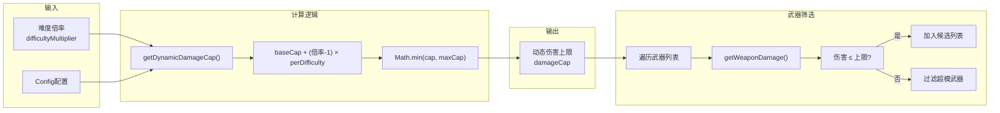

## 1. 高层摘要（TL;DR）

*   **影响范围：** 🔴 **高** - 修复了可能导致服务器卡死/死锁的关键问题，并重构了Boss属性增幅机制
*   **核心变更：**
    *   🛡️ **新增看门狗服务** - 监控服务器线程卡死，自动检测死锁并输出线程堆栈
    *   🔧 **修复区块加载死锁** - 替换AABB扫描为安全遍历，避免在实体生成时触发区块加载
    *   ⚔️ **武器动态伤害上限** - 根据玩家强度动态限制怪物武器伤害，防止超模武器
    *   💀 **Boss防HP爆炸机制** - 防止Boss在区块重新加载时血量指数级增长

---

## 2. 可视化架构图

### 2.1 看门狗服务监控流程


```mermaid
graph TD
    subgraph "WatchdogService 看门狗服务"
        direction TB
        W1["守护线程<br/>watchdogLoop()"]
        W2["检测服务器活跃度<br/>lastActivityNanos"]
        W3["警告阈值 30s<br/>记录实体信息"]
        W4["严重阈值 60s<br/>输出线程堆栈"]
        W5["标记问题实体<br/>problematicEntities"]
        W6["服务器恢复<br/>清空问题实体集"]
        
        W2 -->|elapsedMs < 30s| W6
        W2 -->|30s ≤ elapsedMs < 60s| W3
        W2 -->|elapsedMs ≥ 60s| W4
        W4 --> W5
    end
    
    subgraph "服务器主线程"
        ST1["ServerTickEvent.Post<br/>updateServerTick()"]
        ST2["EnemyScalingHandler<br/>updateEntityProcessing()"]
        ST3["BossDamageCapHandler<br/>updateBossBuffProcessing()"]
    end
    
    ST1 -.->|更新活跃时间戳| W2
    ST2 -.->|更新活跃时间戳| W2
    ST3 -.->|更新活跃时间戳| W2
    
    W5 -.->|跳过缩放| ST2
```

### 2.2 实体缩放防死锁流程


```mermaid
sequenceDiagram
    participant E as EntityJoinLevelEvent
    participant F as EntityFilterHelper
    participant W as WatchdogService
    participant S as EnemyScalingHandler
    participant B as BossDamageCapHandler
    
    E->>F: 检查黑名单
    alt 实体在黑名单
        F-->>E: 跳过处理
    end
    
    E->>W: 检查问题实体集
    alt 实体在问题集中
        W-->>E: 跳过缩放（防死锁）
    end
    
    E->>S: 应用自适应缩放
    S->>W: updateEntityProcessing()
    S->>S: 安全玩家扫描（无AABB）
    S->>S: applyAttributeBonuses()
    S->>S: 检查缩放超时（30s）
    
    alt 是Boss实体
        E->>B: applyBossBuffs()
        B->>B: 检查BOSS_BUFF_APPLIED_TAG
        alt 已应用过Buff
            B-->>E: 跳过（防HP爆炸）
        else 首次应用
            B->>B: 存储原始属性
            B->>B: 叠加EnemyScaling倍率
            B->>B: 标记BOSS_BUFF_APPLIED
        end
    end
```

### 2.3 武器动态伤害上限计算


```mermaid
graph LR
    subgraph "输入"
        D1["难度倍率<br/>difficultyMultiplier"]
        C1["Config配置"]
    end
    
    subgraph "计算逻辑"
        F1["getDynamicDamageCap()"]
        F2["baseCap + (倍率-1) × perDifficulty"]
        F3["Math.min(cap, maxCap)"]
    end
    
    subgraph "输出"
        O1["动态伤害上限<br/>damageCap"]
    end
    
    subgraph "武器筛选"
        W1["遍历武器列表"]
        W2["getWeaponDamage()"]
        W3["伤害 ≤ 上限?"]
        W4["加入候选列表"]
        W5["过滤超模武器"]
    end
    
    D1 --> F1
    C1 --> F1
    F1 --> F2
    F2 --> F3
    F3 --> O1
    
    O1 --> W1
    W1 --> W2
    W2 --> W3
    W3 -->|是| W4
    W3 -->|否| W5
```

---

## 3. 详细变更分析

### 3.1 🐕 看门狗服务（新增）

**文件：** `src/main/java/com/adaptive_nemesis/adaptive_nemesismod/watchdog/WatchdogService.java`（新文件）

**变更说明：**
新增独立的看门狗守护线程，用于监控服务器主线程是否卡死/死锁。

| 配置项 | 类型 | 默认值 | 说明 |
|--------|------|--------|------|
| `enableWatchdog` | Boolean | `true` | 是否启用看门狗服务 |
| `watchdogCheckInterval` | Int | `5` | 检查间隔（秒） |
| `watchdogWarnThreshold` | Int | `30` | 警告阈值（秒） |
| `watchdogCriticalThreshold` | Int | `60` | 严重阈值（秒） |

**核心机制：**
- **两级检测：**
  - ⚠️ **警告级（30s）：** 记录当前处理的实体信息
  - 🚨 **严重级（60s）：** 输出完整线程堆栈，标记问题实体
- **问题实体追踪：** 将卡死期间处理的实体加入 `problematicEntities` 集合，`EnemyScalingHandler` 会跳过这些实体的缩放，避免反复触发死锁
- **线程转储分类：** 按重要性分类输出（死锁线程、服务端线程、BLOCKED线程、WorldGen线程等）

---

### 3.2 🔧 区块加载死锁修复

**影响文件：**
- `src/main/java/com/adaptive_nemesis/adaptive_nemesismod/enemy/EnemyScalingHandler.java`
- `src/main/java/com/adaptive_nemesis/adaptive_nemesismod/enemy/EnchantmentScalingHandler.java`

**问题根源：**
在 `EntityJoinLevelEvent` / `FinalizeSpawnEvent` 中使用 `AABB + getEntitiesOfClass()` 扫描玩家时，会触发范围内区块的加载，与正在进行的世界生成形成死锁（特别是与 Cataclysm 等结构生成模组交互时）。

**解决方案：**
```java
// ❌ 旧代码（会触发区块加载）
AABB searchBox = new AABB(...);
List<ServerPlayer> nearbyPlayers = serverLevel.getEntitiesOfClass(ServerPlayer.class, searchBox);

// ✅ 新代码（安全遍历，不触发区块加载）
double rangeSq = range * range;
List<ServerPlayer> nearbyPlayers = new ArrayList<>();
for (ServerPlayer player : serverLevel.getServer().getPlayerList().getPlayers()) {
    if (player.level() == serverLevel && player.distanceToSqr(mob) <= rangeSq) {
        nearbyPlayers.add(player);
    }
}
```

**新增防御机制：**
- **缩放超时标记：** `SCALE_TIMEOUT_TAG` - 如果实体缩放处理超过30秒，自动标记为问题实体
- **异常捕获：** 在 `onEntityJoinLevel()` 中添加 try-catch，防止第三方模组异常导致服务器崩溃
- **看门狗集成：** 处理实体前后更新看门狗状态，便于追踪卡死源头

---

### 3.3 ⚔️ 武器动态伤害上限

**影响文件：**
- `src/main/java/com/adaptive_nemesis/Config.java`
- `src/main/java/com/adaptive_nemesis/adaptive_nemesismod/enemy/EnchantmentScalingHandler.java`

**新增配置：**

| 配置项 | 默认值 | 说明 |
|--------|--------|------|
| `weaponDamageBaseCap` | `12.0` | 最低难度时的武器伤害上限（6颗心） |
| `weaponDamageCapPerDifficulty` | `3.0` | 每单位难度倍率增加的伤害上限 |
| `weaponDamageMaxCap` | `40.0` | 绝对伤害上限（20颗心） |

**计算公式：**
```
动态上限 = 基础值 + (难度倍率 - 1.0) × 每倍率增量
最终上限 = min(动态上限, 绝对上限)
```

**武器筛选逻辑：**
1. 从当前品质等级向下遍历武器列表
2. 使用 `getWeaponDamage()` 计算武器实际伤害（含属性修饰器）
3. 只选择伤害不超过上限的武器
4. 如果所有武器都超限，使用木剑保底

**模组武器过滤：**
在 `tryGetModEquipment()` 中，主手武器会检查伤害上限，超模武器会被过滤并记录调试日志。

---

### 3.4 💀 Boss防HP爆炸机制

**影响文件：** `src/main/java/com/adaptive_nemesis/adaptive_nemesismod/boss/BossDamageCapHandler.java`

**问题场景：**
`EntityJoinLevelEvent` 可能在以下场景多次触发：
- 玩家传送离开后区块卸载，返回后区块重新加载
- 玩家切换维度后实体重新加载
- 服务器重启后实体从磁盘加载

如果没有检查，Boss血量会在每次重新加载时乘以 `BOSS_HEALTH_MULTIPLIER`，导致指数级爆炸。

**解决方案：**

| 新增NBT标签 | 用途 |
|------------|------|
| `BOSS_BUFF_APPLIED_TAG` | 标记Boss Buff已应用，防止重复触发 |
| `BOSS_ORIGINAL_HEALTH_TAG` | 存储原始基础生命值 |
| `BOSS_ORIGINAL_DAMAGE_TAG` | 存储原始基础伤害值 |

**属性计算逻辑：**
```
最终血量 = 原始血量 × EnemyScaling倍率 × Boss倍率
最终伤害 = 原始伤害 × EnemyScaling倍率 × Boss倍率
```

这样无论 `EnemyScalingHandler` 和 `BossDamageCapHandler` 的执行顺序如何，都能基于同一原始值正确叠加。

---

### 3.5 🎯 其他优化

**EnchantmentScalingHandler.java：**
- 优化人形生物判定逻辑，使用精确的实体ID匹配替代字符串包含判断
- 新增支持的生物类型：沼骸、猪灵、猪灵蛮兵等

**ModEventHandler.java：**
- 在 `ServerTickEvent.Post` 中更新看门狗 tick 时间戳
- 在 `onServerStopping` 中停止看门狗服务
- Boss处理前后注入看门狗状态

**AdaptiveNemesisMod.java：**
- 在配置加载完毕后启动看门狗服务

**gradle.properties：**
- 版本号从 `1.0.6` 升级到 `1.0.7`

---

## 4. 影响与风险评估

### 4.1 ⚠️ 破坏性变更

| 变更类型 | 影响范围 | 说明 |
|----------|----------|------|
| 配置新增 | 所有用户 | 新增7个配置项，但都有默认值，无需手动配置 |
| 行为变更 | Boss属性 | Boss血量/伤害计算方式改变，可能影响游戏平衡 |
| 行为变更 | 怪物武器 | 超模武器会被过滤，可能降低怪物强度 |

### 4.2 🧪 测试建议

**核心测试场景：**
1. ✅ **区块加载死锁测试：**
   - 在 Cataclysm 等结构生成模组环境下测试
   - 验证服务器不会在实体生成时卡死
   - 检查看门狗日志是否正确记录卡死信息

2. ✅ **Boss属性测试：**
   - 生成Boss后传送远离再返回
   - 切换维度后再返回
   - 验证Boss血量不会指数级增长

3. ✅ **武器伤害上限测试：**
   - 在不同难度倍率下生成怪物
   - 验证怪物武器伤害不超过动态上限
   - 检查模组武器是否被正确过滤

4. ✅ **看门狗服务测试：**
   - 模拟服务器卡死（如长时间sleep）
   - 验证看门狗是否在30s/60s输出警告/严重日志
   - 验证问题实体是否被正确跳过

**日志检查点：**
- `🐕 看门狗服务已启动` - 确认看门狗正常启动
- `🛡️ 防HP爆炸：Boss Buff 已应用过则跳过` - 确认防重复机制生效
- `⛔ 过滤超模武器` - 确认武器过滤机制生效
- `📡 [Player扫描]` - 确认安全玩家扫描正常工作

---

## 5. 配置迁移指南

**新增配置项（自动使用默认值）：**

```toml
[watchdog]
enableWatchdog = true
watchdogCheckInterval = 5
watchdogWarnThreshold = 30
watchdogCriticalThreshold = 60

[weaponDamageCap]
weaponDamageBaseCap = 12.0
weaponDamageCapPerDifficulty = 3.0
weaponDamageMaxCap = 40.0
```

**建议调整：**
- 如果服务器性能较弱，可适当提高 `watchdogCheckInterval`
- 如果希望怪物武器更强，可提高 `weaponDamageBaseCap` 和 `weaponDamageCapPerDifficulty`

---