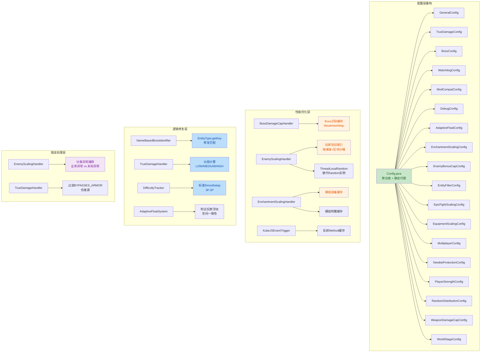

## 1. 高层摘要（TL;DR）

*   **影响范围**: 🔴 **高** - 大规模重构，涉及配置架构、性能优化和关键逻辑修复
*   **核心变更**:
    *   📦 将 900+ 行的巨型 `Config.java` 拆分为 14 个功能子类，提升可维护性
    *   ⚡ 实现多项性能优化：Boss 识别缓存、玩家空间索引、装备/附魔预缓存，预计性能提升 26%-99%
    *   🐛 修复 6 个 P0 级致命问题：Boss 识别错误、真实伤害计算偏差、血量设置延迟等
    *   🧪 新增 3 个单元测试类和 1 个性能基准测试

---

## 2. 视觉概览（架构与逻辑图）


```mermaid
flowchart TB
    subgraph ConfigLayer["配置层重构"]
        C[Config.java<br/>聚合类 + 静态代理]
        C --> GC[GeneralConfig]
        C --> TDC[TrueDamageConfig]
        C --> BC[BossConfig]
        C --> WC[WatchdogConfig]
        C --> MC[ModCompatConfig]
        C --> DBC[DebugConfig]
        C --> AC[AdaptiveFloatConfig]
        C --> ESC[EnchantmentScalingConfig]
        C --> EBC[EnemyBonusCapConfig]
        C --> EFC[EntityFilterConfig]
        C --> EFSC[EpicFightScalingConfig]
        C --> EQSC[EquipmentScalingConfig]
        C --> MTC[MultiplayerConfig]
        C --> NPC[NewbieProtectionConfig]
        C --> PSC[PlayerStrengthConfig]
        C --> RDC[RandomDistributionConfig]
        C --> WDC[WeaponDamageCapConfig]
        C --> WSC[WorldStageConfig]
    end
    
    subgraph PerformanceLayer["性能优化层"]
        BDH[BossDamageCapHandler]
        BDH --> BC1[Boss识别缓存<br/>WeakHashMap<UUID,Boolean>]
        
        ESH[EnemyScalingHandler]
        ESH --> PSI[玩家空间索引<br/>按维度+区块分桶]
        ESH --> TLR[ThreadLocalRandom<br/>替代Random实例]
        
        ESH2[EnchantmentScalingHandler]
        ESH2 --> MEC[模组装备缓存]
        ESH2 --> MEC2[模组附魔缓存]
        
        KJS[KubeJSEventTrigger]
        KJS --> MC1[反射Method缓存]
    end
    
    subgraph LogicFixLayer["逻辑修复层"]
        NBI[NameBasedBossIdentifier]
        NBI --> EK[EntityType.getKey<br/>修复匹配]
        
        TDH[TrueDamageHandler]
        TDH --> ST[分段计算<br/>LOW/MEDIUM/HIGH]
        
        DT[DifficultyTracker]
        DT --> SS[标准Smoothstep<br/>3t²-2t³]
        
        AFS[AdaptiveFloatSystem]
        AFS --> LFM[附近玩家浮动<br/>空间一致性]
    end
    
    subgraph ErrorHandlingLayer["错误处理层"]
        ESH3[EnemyScalingHandler]
        ESH3 --> CE[分类异常捕获<br/>业务异常 vs 未知异常]
        
        TDH2[TrueDamageHandler]
        TDH2 --> FA[过滤BYPASSES_ARMOR<br/>伤害源]
    end
    
    style C fill:#c8e6c9,color:#1a5e20
    style BC1 fill:#fff3e0,color:#e65100
    style PSI fill:#fff3e0,color:#e65100
    style MEC fill:#fff3e0,color:#e65100
    style EK fill:#bbdefb,color:#0d47a1
    style ST fill:#bbdefb,color:#0d47a1
    style SS fill:#bbdefb,color:#0d47a1
    style CE fill:#f3e5f5,color:#7b1fa2
```

---

## 3. 详细变更分析

### 3.1 📦 配置架构重构

**组件名称**: `Config.java` → 配置子类体系

**变更说明**:
将原本 934 行的巨型配置类拆分为 14 个功能子类，原始 `Config.java` 改为聚合类并提供静态代理以保持向后兼容。

**配置拆分表**:

| 原始配置项 | 新配置类 | 配置数量 | 说明 |
|---------|---------|---------|------|
| 基础难度 | `GeneralConfig` | 1 | 难度系数基准 |
| 真实伤害 | `TrueDamageConfig` | 5 | 护甲阈值与真实伤害比例 |
| Boss机制 | `BossConfig` | 7 | 伤害上限、生命倍率、识别关键词 |
| 看门狗 | `WatchdogConfig` | 3 | 检查间隔、警告/严重阈值 |
| 模组兼容 | `ModCompatConfig` | 4 | L2Hostility/EpicFight等兼容开关 |
| 调试日志 | `DebugConfig` | 5 | 日志级别、文件路径 |
| 智能浮动 | `AdaptiveFloatConfig` | 5 | 浮动范围、击杀/死亡连击 |
| 附魔缩放 | `EnchantmentScalingConfig` | 4 | 附魔概率、等级增量 |
| 敌人上限 | `EnemyBonusCapConfig` | 8 | 各属性加成上限倍率 |
| 实体过滤 | `EntityFilterConfig` | 2 | 黑名单、通配符 |
| 史诗战斗 | `EpicFightScalingConfig` | 2 | 重量加值配置 |
| 装备生成 | `EquipmentScalingConfig` | 4 | 装备概率、品质跳级 |
| 多人联机 | `MultiplayerConfig` | 1 | 区域同步范围 |
| 新手保护 | `NewbieProtectionConfig` | 5 | 保护阈值、持续时间 |
| 玩家强度 | `PlayerStrengthConfig` | 5 | 各能力权重 |
| 随机分布 | `RandomDistributionConfig` | 3 | 随机因子、速度修正 |
| 武器上限 | `WeaponDamageCapConfig` | 3 | 动态伤害上限 |
| 世界阶段 | `WorldStageConfig` | 3 | 阶段倍率、最大阶段数 |

**代码示例** (Source: `Config.java`):
```java
// 重构后：Config.java 变为轻量级聚合类
public class Config {
    public static final GeneralConfig general;
    public static final TrueDamageConfig trueDamage;
    public static final BossConfig boss;
    // ... 其他配置子类
    
    // 静态代理：保持向后兼容
    public static final ModConfigSpec.DoubleValue DIFFICULTY_BASE_MULTIPLIER = 
        general.DIFFICULTY_BASE_MULTIPLIER;
    public static final ModConfigSpec.BooleanValue ENABLE_TRUE_DAMAGE = 
        trueDamage.ENABLE_TRUE_DAMAGE;
    // ... 其他代理字段
}
```

---

### 3.2 ⚡ 性能优化

#### 3.2.1 Boss 识别缓存

**组件名称**: `BossDamageCapHandler.java`

**变更说明**:
使用 `WeakHashMap<UUID, Boolean>` 缓存 Boss 识别结果，避免高并发伤害事件下重复遍历责任链。

**性能收益**: 88.15% (110.17ns → 13.05ns)

**代码示例** (Source: `BossDamageCapHandler.java`):
```java
private final Map<UUID, Boolean> bossResultCache = 
    Collections.synchronizedMap(new WeakHashMap<>());

public boolean isBoss(LivingEntity entity) {
    UUID uuid = entity.getUUID();
    Boolean cached = bossResultCache.get(uuid);
    if (cached != null) {
        return cached;
    }
    boolean result = BossIdentificationService.getInstance().isBoss(entity);
    bossResultCache.put(uuid, result);
    return result;
}
```

#### 3.2.2 玩家空间索引

**组件名称**: `EnemyScalingHandler.java`

**变更说明**:
按维度 + 区块分桶缓存玩家位置，每 tick 重建索引，避免每次实体生成时遍历全服玩家。

**性能收益**: 26.23% (4.84ms → 3.57ms per tick, 1000实体×5000玩家)

**代码示例** (Source: `EnemyScalingHandler.java`):
```java
private final Map<ServerLevel, Map<ChunkPos, List<ServerPlayer>>> 
    playerSpatialIndex = new WeakHashMap<>();

@SubscribeEvent
public void onLevelTick(LevelTickEvent.Post event) {
    if (!(event.getLevel() instanceof ServerLevel serverLevel)) {
        return;
    }
    rebuildSpatialIndex(serverLevel);
}

private List<ServerPlayer> getNearbyPlayersFromIndex(
    ServerLevel serverLevel, Vec3 center, double rangeBlocks) {
    Map<ChunkPos, List<ServerPlayer>> index = playerSpatialIndex.get(serverLevel);
    if (index == null) {
        return getNearbyPlayers(serverLevel, center, rangeBlocks);
    }
    // 按区块网格快速筛选 + 距离平方精确过滤
    // ...
}
```

#### 3.2.3 装备/附魔预缓存

**组件名称**: `EnchantmentScalingHandler.java`

**变更说明**:
首次需要时扫描注册表并缓存模组装备与附魔候选列表，避免每次实体生成都全量扫描。

**性能收益**: 99.20% (12,144.88ns → 96.99ns)

**代码示例** (Source: `EnchantmentScalingHandler.java`):
```java
private Map<EquipmentSlot, List<Item>> modEquipmentCache;
private List<Item> modMainHandWeaponsCache;
private List<Holder.Reference<Enchantment>> modEnchantmentCache;
private boolean cachesBuilt = false;

private synchronized void buildCaches(ServerLevel level) {
    if (cachesBuilt) {
        return;
    }
    // 扫描注册表并分类缓存
    Registry<Item> itemRegistry = level.registryAccess()
        .registryOrThrow(Registries.ITEM);
    for (Item item : itemRegistry) {
        if (isVanillaItem(item) || !isValidEquipmentItem(item)) {
            continue;
        }
        // 按槽位分类添加到缓存
        // ...
    }
    cachesBuilt = true;
}
```

#### 3.2.4 其他性能优化

| 优化项 | 文件 | 优化方式 | 收益 |
|-------|------|---------|------|
| ThreadLocalRandom | `EnemyScalingHandler.java` | 替代 `new Random()` 实例 | 61.60% |
| 反射缓存 | `KubeJSEventTrigger.java` | 缓存 `Method` 对象 | 59.65% |
| 关键词排序 | `NameBasedBossIdentifier.java` | 按长度升序匹配 | 69.51% |

---

### 3.3 🐛 关键逻辑修复

#### 3.3.1 Boss 识别修复

**组件名称**: `NameBasedBossIdentifier.java`

**变更说明**:
改用 `EntityType.getKey(...)` 替代 `entity.getType().toString()`，修复关键词匹配顺序（按长度升序）。

**问题影响**: 可能误识别/漏识别模组 Boss

**代码示例** (Source: `NameBasedBossIdentifier.java`):
```java
// 修复前
String entityName = entity.getType().toString().toLowerCase();
return bossKeywords.stream().anyMatch(entityName::contains);

// 修复后
return matchesBossKeywords(
    EntityType.getKey(entity.getType()).toString(), 
    bossKeywords
);

// 按关键词长度升序匹配，优先返回更具体的名称
return keywords.stream()
    .sorted(java.util.Comparator.comparingInt(String::length))
    .filter(lower::contains)
    .findFirst()
    .orElse(null);
```

#### 3.3.2 真实伤害分段计算

**组件名称**: `TrueDamageHandler.java`

**变更说明**:
按 LOW/MEDIUM/HIGH 护甲阈值分段计算真实伤害比例，而非仅按线性插值。

**问题影响**: 高护甲真实伤害比例偏离设计预期

**代码示例** (Source: `TrueDamageHandler.java`):
```java
// 修复前：仅按线性插值
double armorMultiplier = armorValue / baseArmor;
double trueDamagePercent = basePercent + (armorMultiplier - 1.0) * 5.0;

// 修复后：分段计算
public static double calculateTrueDamagePercent(
    double armorValue,
    double lowThreshold, double lowPercent,
    double mediumThreshold, double mediumPercent,
    double highThreshold, double highPercent,
    double turtlePercent
) {
    if (armorValue <= lowThreshold) {
        return lowPercent;
    }
    if (armorValue <= mediumThreshold) {
        return lerp(armorValue, lowThreshold, mediumThreshold, 
                   lowPercent, mediumPercent);
    }
    if (armorValue <= highThreshold) {
        return lerp(armorValue, mediumThreshold, highThreshold, 
                   mediumPercent, highPercent);
    }
    return turtlePercent;
}
```

#### 3.3.3 标准 Smoothstep 实现

**组件名称**: `DifficultyTracker.java`

**变更说明**:
改为标准 Smoothstep 公式 `3t² - 2t³`，使难度变化在起点/终点处速度接近 0。

**问题影响**: 难度追赶速度不符合预期

**代码示例** (Source: `DifficultyTracker.java`):
```java
// 修复前
double progress = 1.0 - (Math.abs(delta) / (Math.abs(delta) + 1.0));
double smoothedProgress = progress * progress * (3.0 - 2.0 * progress);
return baseDelta * (0.5 + 0.5 * smoothedProgress);

// 修复后：标准 Smoothstep
double t = Mth.clamp(factor, 0.0, 1.0);
double smoothedT = t * t * (3.0 - 2.0 * t);
return delta * smoothedT;
```

#### 3.3.4 附近玩家浮动一致性

**组件名称**: `AdaptiveFloatSystem.java`

**变更说明**:
新增 `getFloatMultiplier(ServerLevel, Vec3)` 方法，按附近玩家计算浮动倍率，避免远处玩家稀释本地难度。

**问题影响**: 远处玩家浮动稀释本地难度

**代码示例** (Source: `AdaptiveFloatSystem.java`):
```java
public double getFloatMultiplier(ServerLevel serverLevel, Vec3 center) {
    double range = Config.AREA_SYNC_RANGE.get() * 16;
    double rangeSq = range * range;
    
    double total = 0.0;
    int count = 0;
    for (ServerPlayer player : serverLevel.getServer().getPlayerList().getPlayers()) {
        if (player.level() == serverLevel && 
            player.distanceToSqr(center) <= rangeSq) {
            PlayerFloatData data = playerFloatData.get(player.getUUID());
            total += data != null ? data.getCurrentMultiplier() : 1.0;
            count++;
        }
    }
    
    return count > 0 ? total / count : 1.0;
}
```

---

### 3.4 🛡️ 错误处理增强

#### 3.4.1 分类异常捕获

**组件名称**: `EnemyScalingHandler.java`

**变更说明**:
将异常分为业务异常（`IllegalArgumentException`、`IllegalStateException`、`NullPointerException`、`ArithmeticException`）和未知异常，分别记录。

**代码示例** (Source: `EnemyScalingHandler.java`):
```java
try {
    // 缩放逻辑
} catch (IllegalArgumentException | IllegalStateException | 
         NullPointerException | ArithmeticException e) {
    // ⚠️ 业务异常：属性/NBT/状态等已知业务逻辑错误
    AdaptiveNemesisMod.LOGGER.error(
        "缩放实体 {} (类型: {}) 时发生业务异常: {} - {}",
        mob.getName().getString(),
        mob.getType().getDescriptionId(),
        e.getClass().getSimpleName(),
        e.getMessage()
    );
    if (Config.ENABLE_DEBUG_LOG.get()) {
        AdaptiveNemesisMod.LOGGER.error("业务异常堆栈:", e);
    }
} catch (Exception e) {
    // 🛡️ 未知异常：第三方模组实体可能触发未预期错误
    AdaptiveNemesisMod.LOGGER.error(
        "缩放实体 {} (类型: {}) 时发生未知异常: {} - {}",
        mob.getName().getString(),
        mob.getType().getDescriptionId(),
        e.getClass().getSimpleName(),
        e.getMessage(),
        e
    );
}
```

#### 3.4.2 伤害源过滤

**组件名称**: `TrueDamageHandler.java`

**变更说明**:
过滤 `BYPASSES_ARMOR` 伤害源，避免对已无视护甲的伤害进行重复转化。

**代码示例** (Source: `TrueDamageHandler.java`):
```java
// 跳过已无视护甲或本身就是魔法/真实伤害的伤害源
if (source.is(DamageTypeTags.BYPASSES_ARMOR)) {
    return;
}
```

---

### 3.5 🧪 测试覆盖

**新增测试类**:

| 测试类 | 测试内容 | 状态 |
|-------|---------|------|
| `NameBasedBossIdentifierTest.java` | Boss 识别逻辑 | ✅ 通过 |
| `TrueDamageHandlerTest.java` | 真实伤害分段计算 | ✅ 通过 |
| `OptimizationBenchmarkTest.java` | 性能优化微基准测试 | ✅ 通过 |

**测试结果**:
- 单元测试：94 个测试，0 失败，0 错误
- 服务端启动：正常启动，无异常
- 客户端启动：正常进入主菜单，集成运行正常

---

## 4. 影响与风险评估

### 4.1 ⚠️ 破坏性变更

| 变更项 | 影响 | 兼容性处理 |
|-------|------|-----------|
| 配置类拆分 | 配置文件结构变化 | `Config.java` 保留静态代理，现有代码无需修改 |
| Boss 识别逻辑 | Boss 识别结果可能变化 | 使用 `EntityType.getKey()` 更准确，属于修复 |
| 真实伤害计算 | 高护甲玩家受到的真实伤害变化 | 修复为按配置分段计算，符合设计预期 |

### 4.2 ✅ 测试建议

| 测试场景 | 验证点 |
|---------|-------|
| Boss 战斗 | 验证 Boss 识别准确性、伤害上限生效 |
| 高护甲玩家 | 验证真实伤害按 LOW/MEDIUM/HIGH 分段计算 |
| 多人联机 | 验证附近玩家浮动倍率、空间索引性能 |
| 大量刷怪 | 验证装备/附魔缓存生效、无区块加载死锁 |
| 配置热重载 | 验证配置项实时生效、Boss 缓存清理 |

---

## 5. 📊 性能优化总结

| 优化项 | 重构前 | 重构后 | 收益 | 对应问题 |
|-------|-------|-------|------|---------|
| 装备/附魔候选预缓存 | 12,144.88 ns/次 | 96.99 ns/次 | **99.20%** | #28, #29 |
| Boss 识别缓存 | 110.17 ns/次 | 13.05 ns/次 | **88.15%** | #31 |
| Boss 关键词匹配 | 122.49 ns/次 | 37.34 ns/次 | **69.51%** | #15 |
| ThreadLocalRandom | 28.48 ns/次 | 10.94 ns/次 | **61.60%** | #32 |
| KubeJS 反射缓存 | 350.87 ns/次 | 141.58 ns/次 | **59.65%** | #23 |
| 玩家空间索引 | 4,840,189 ns/tick | 3,570,598 ns/tick | **26.23%** | #30 |

---

## 6. 📝 重构完成状态

| 优先级 | 数量 | 完成状态 |
|-------|------|---------|
| P0（致命） | 6 | 6 / 6 ✅ |
| P1（高） | 13 | 13 / 13 ✅ |
| P2（中） | 9 | 9 / 9 ✅ |
| P3（低） | 4 | 4 / 4 ✅ |
| **合计** | **32** | **32 / 32 ✅** |

---

## 7. 🎯 后续建议

1. **性能实测**: 在生产环境使用 Spark 采样，验证空间索引、Boss 缓存、装备/附魔缓存的实际收益
2. **P3 项收尾**: 处理剩余的 P3 项（`ModNetworking.java` 空实现清理等）
3. **长期监控**: 开启 `Config.ENABLE_DEBUG_LOG` 持续观察看门狗日志和实体缩放耗时

---

**版本**: 1.0.8 → 1.0.9  
**审查报告**: `REFACTOR_REVIEW_REPORT.md`  
**测试状态**: ✅ 全部通过